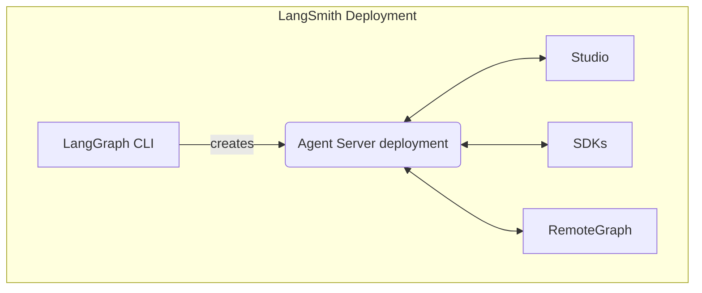

When running self-hosted [LangSmith Deployment](/langsmith/deploy-self-hosted-full-platform), your installation includes several key components. Together these tools and services provide a complete solution for building, deploying, and managing graphs (including agentic applications) in your own infrastructure:

- [Agent Server](/langsmith/agent-server): Defines an opinionated API and runtime for deploying graphs and agents. Handles execution, state management, and persistence so you can focus on building logic rather than server infrastructure.
- [LangGraph CLI](/langsmith/cli): A command-line interface to build, package, and interact with graphs locally and prepare them for deployment.
- [Studio](/langsmith/studio): A specialized IDE for visualization, interaction, and debugging. Connects to a local Agent Server for developing and testing your graph.
- [Python/JS SDK](/langsmith/sdk): The Python/JS SDK provides a programmatic way to interact with deployed graphs and agents from your applications.
- [RemoteGraph](/langsmith/use-remote-graph): Allows you to interact with a deployed graph as though it were running locally.
- [Control Plane](/langsmith/control-plane): The UI and APIs for creating, updating, and managing Agent Server deployments.
- [Data plane](/langsmith/data-plane): The runtime layer that executes your graphs, including Agent Servers, their backing services (PostgreSQL, Redis, etc.), and the listener that reconciles state from the control plane.

---

<Callout icon="pen-to-square" iconType="regular">
    [Edit the source of this page on GitHub.](https://github.com/langchain-ai/docs/edit/main/src/langsmith\components.mdx)
</Callout>
<Tip icon="terminal" iconType="regular">
    [Connect these docs programmatically](/use-these-docs) to Claude, VSCode, and more via MCP for real-time answers.
</Tip>
