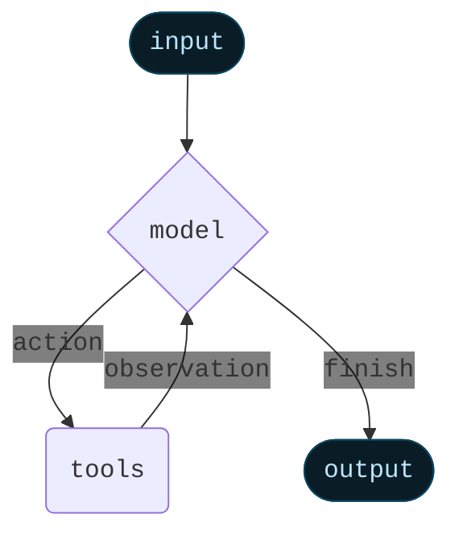

智能体将语言模型与[工具](/oss/javascript/langchain/tools)结合，创建能够推理任务、决定使用哪些工具并迭代地朝着解决方案努力的系统。


`createAgent()` 提供了生产就绪的智能体实现。


[LLM 智能体在循环中运行工具以实现目标](https://simonwillison.net/2025/Sep/18/agents/)。
智能体会一直运行，直到满足停止条件——即模型发出最终输出或达到迭代限制。



<Info>


`createAgent()` 使用 [LangGraph](/oss/javascript/langgraph/overview) 构建基于**图**的智能体运行时。图由节点（步骤）和边（连接）组成，定义智能体如何处理信息。智能体通过此图移动，执行节点，如模型节点（调用模型）、工具节点（执行工具）或中间件。


了解更多关于[图 API](/oss/javascript/langgraph/graph-api)的信息。

</Info>

## 核心组件

### 模型

[模型](/oss/javascript/langchain/models)是智能体的推理引擎。可以通过多种方式指定，支持静态和动态模型选择。

#### 静态模型

静态模型在创建智能体时配置一次，并在整个执行过程中保持不变。这是最常见和直接的方法。

要从<Tooltip tip="遵循格式 `provider:model` 的字符串（例如 openai:gpt-5）" cta="查看映射" href="https://reference.langchain.com/python/langchain/models/#langchain.chat_models.init_chat_model(model)">模型标识符字符串</Tooltip>初始化静态模型：


```ts wrap
import { createAgent } from "langchain";

const agent = createAgent({
  model: "gpt-5",
  tools: []
});
```


模型标识符字符串使用格式 `provider:model`（例如 `"openai:gpt-5"`）。您可能希望对模型配置有更多控制，在这种情况下，可以直接使用提供者包初始化模型实例：

```ts wrap
import { createAgent } from "langchain";
import { ChatOpenAI } from "@langchain/openai";

const model = new ChatOpenAI({
  model: "gpt-4o",
  temperature: 0.1,
  maxTokens: 1000,
  timeout: 30
});

const agent = createAgent({
  model,
  tools: []
});
```

模型实例让您完全控制配置。当您需要设置特定参数（如 `temperature`、`max_tokens`、`timeouts`）或配置 API 密钥、`base_url` 和其他提供者特定设置时，请使用它们。请参阅 [API 参考](/oss/javascript/integrations/providers/)以查看模型上可用的参数和方法。


#### 动态模型

动态模型在<Tooltip tip="智能体的执行环境，包含在智能体整个执行过程中持续存在的不可变配置和上下文数据（例如，用户 ID、会话详细信息或应用程序特定配置）。">运行时</Tooltip>根据当前<Tooltip tip="流经智能体执行的数据，包括消息、自定义字段以及在处理过程中需要跟踪和可能修改的任何信息（例如，用户偏好或工具使用统计）。">状态</Tooltip>和上下文进行选择。这支持复杂的路由逻辑和成本优化。


要使用动态模型，创建带有 `wrapModelCall` 的中间件，修改请求中的模型：

```ts
import { ChatOpenAI } from "@langchain/openai";
import { createAgent, createMiddleware } from "langchain";

const basicModel = new ChatOpenAI({ model: "gpt-4o-mini" });
const advancedModel = new ChatOpenAI({ model: "gpt-4o" });

const dynamicModelSelection = createMiddleware({
  name: "DynamicModelSelection",
  wrapModelCall: (request, handler) => {
    // Choose model based on conversation complexity
    const messageCount = request.messages.length;

    return handler({
        ...request,
        model: messageCount > 10 ? advancedModel : basicModel,
    });
  },
});

const agent = createAgent({
  model: "gpt-4o-mini", // Base model (used when messageCount ≤ 10)
  tools,
  middleware: [dynamicModelSelection],
});
```

有关中间件和高级模式的更多详细信息，请参阅[中间件文档](/oss/javascript/langchain/middleware)。


<Tip>
有关模型配置的详细信息，请参阅[模型](/oss/javascript/langchain/models)。有关动态模型选择模式，请参阅[中间件中的动态模型](/oss/javascript/langchain/middleware#dynamic-model)。
</Tip>

### 工具

工具赋予智能体执行操作的能力。智能体通过以下方式超越了简单的仅模型工具绑定：

- 顺序多次工具调用（由单个提示触发）
- 在适当时并行工具调用
- 基于先前结果的动态工具选择
- 工具重试逻辑和错误处理
- 跨工具调用的状态持久化

更多信息，请参阅[工具](/oss/javascript/langchain/tools)。

#### 定义工具

将工具列表传递给智能体。


```ts wrap
import * as z from "zod";
import { createAgent, tool } from "langchain";

const search = tool(
  ({ query }) => `Results for: ${query}`,
  {
    name: "search",
    description: "Search for information",
    schema: z.object({
      query: z.string().describe("The query to search for"),
    }),
  }
);

const getWeather = tool(
  ({ location }) => `Weather in ${location}: Sunny, 72°F`,
  {
    name: "get_weather",
    description: "Get weather information for a location",
    schema: z.object({
      location: z.string().describe("The location to get weather for"),
    }),
  }
);

const agent = createAgent({
  model: "gpt-4o",
  tools: [search, getWeather],
});
```


如果提供空工具列表，智能体将仅包含一个没有工具调用能力的 LLM 节点。

#### 工具错误处理


要自定义工具错误的处理方式，在自定义中间件中使用 `wrapToolCall` 钩子：

```ts wrap
import { createAgent, createMiddleware, ToolMessage } from "langchain";

const handleToolErrors = createMiddleware({
  name: "HandleToolErrors",
  wrapToolCall: async (request, handler) => {
    try {
      return await handler(request);
    } catch (error) {
      // Return a custom error message to the model
      return new ToolMessage({
        content: `Tool error: Please check your input and try again. (${error})`,
        tool_call_id: request.toolCall.id!,
      });
    }
  },
});

const agent = createAgent({
  model: "gpt-4o",
  tools: [
    /* ... */
  ],
  middleware: [handleToolErrors],
});
```

当工具失败时，智能体将返回带有自定义错误消息的 @[`ToolMessage`]。


#### ReAct 循环中的工具使用

智能体遵循 ReAct（"推理 + 行动"）模式，在带有针对性工具调用的简短推理步骤和将结果观察反馈到后续决策之间交替，直到它们能够提供最终答案。

<Accordion title="ReAct 循环示例">
提示：识别当前最受欢迎的无线耳机并验证可用性。

```
================================ Human Message =================================

Find the most popular wireless headphones right now and check if they're in stock
```

* **推理**："受欢迎程度是时间敏感的，我需要使用提供的搜索工具。"
* **行动**：调用 `search_products("wireless headphones")`

```
================================== Ai Message ==================================
Tool Calls:
  search_products (call_abc123)
 Call ID: call_abc123
  Args:
    query: wireless headphones
```
```
================================= Tool Message =================================

Found 5 products matching "wireless headphones". Top 5 results: WH-1000XM5, ...
```

* **推理**："我需要在回答之前确认排名第一的商品的可用性。"
* **行动**：调用 `check_inventory("WH-1000XM5")`

```
================================== Ai Message ==================================
Tool Calls:
  check_inventory (call_def456)
 Call ID: call_def456
  Args:
    product_id: WH-1000XM5
```
```
================================= Tool Message =================================

Product WH-1000XM5: 10 units in stock
```

* **推理**："我有了最受欢迎的型号及其库存状态。我现在可以回答用户的问题了。"
* **行动**：产生最终答案

```
================================== Ai Message ==================================

I found wireless headphones (model WH-1000XM5) with 10 units in stock...
```
</Accordion>

<Tip>
要了解更多关于工具的信息，请参阅[工具](/oss/javascript/langchain/tools)。
</Tip>

### 系统提示


您可以通过提供提示来塑造智能体处理任务的方式。`systemPrompt` 参数可以作为字符串提供：


```ts wrap
const agent = createAgent({
  model,
  tools,
  systemPrompt: "You are a helpful assistant. Be concise and accurate.",
});
```


当未提供 @[`system_prompt`] 时，智能体将直接从消息推断其任务。

#### 动态系统提示

对于需要根据运行时上下文或智能体状态修改系统提示的更高级用例，您可以使用[中间件](/oss/javascript/langchain/middleware)。


```typescript wrap
import * as z from "zod";
import { createAgent, dynamicSystemPromptMiddleware } from "langchain";

const contextSchema = z.object({
  userRole: z.enum(["expert", "beginner"]),
});

const agent = createAgent({
  model: "gpt-4o",
  tools: [/* ... */],
  contextSchema,
  middleware: [
    dynamicSystemPromptMiddleware<z.infer<typeof contextSchema>>((state, runtime) => {
      const userRole = runtime.context.userRole || "user";
      const basePrompt = "You are a helpful assistant.";

      if (userRole === "expert") {
        return `${basePrompt} Provide detailed technical responses.`;
      } else if (userRole === "beginner") {
        return `${basePrompt} Explain concepts simply and avoid jargon.`;
      }
      return basePrompt;
    }),
  ],
});

// The system prompt will be set dynamically based on context
const result = await agent.invoke(
  { messages: [{ role: "user", content: "Explain machine learning" }] },
  { context: { userRole: "expert" } }
);
```


<Tip>
有关消息类型和格式的更多详细信息，请参阅[消息](/oss/javascript/langchain/messages)。有关全面的中间件文档，请参阅[中间件](/oss/javascript/langchain/middleware)。
</Tip>

## 调用

您可以通过向其[`State`](/oss/javascript/langgraph/graph-api#state)传递更新来调用智能体。所有智能体在其状态中都包含[消息序列](/oss/javascript/langgraph/use-graph-api#messagesstate)；要调用智能体，请传递新消息：


```typescript
await agent.invoke({
  messages: [{ role: "user", content: "What's the weather in San Francisco?" }],
})
```


要流式传输智能体的步骤和/或令牌，请参阅[流式传输](/oss/javascript/langchain/streaming)指南。

否则，智能体遵循 LangGraph [图 API](/oss/javascript/langgraph/use-graph-api)并支持所有相关方法，如 `stream` 和 `invoke`。

## 高级概念

### 结构化输出


在某些情况下，您可能希望智能体以特定格式返回输出。LangChain 通过 `responseFormat` 参数提供简单、通用的方法来实现这一点。

```ts wrap
import * as z from "zod";
import { createAgent } from "langchain";

const ContactInfo = z.object({
  name: z.string(),
  email: z.string(),
  phone: z.string(),
});

const agent = createAgent({
  model: "gpt-4o",
  responseFormat: ContactInfo,
});

const result = await agent.invoke({
  messages: [
    {
      role: "user",
      content: "Extract contact info from: John Doe, john@example.com, (555) 123-4567",
    },
  ],
});

console.log(result.structuredResponse);
// {
//   name: 'John Doe',
//   email: 'john@example.com',
//   phone: '(555) 123-4567'
// }
```

<Tip>
    要了解结构化输出，请参阅[结构化输出](/oss/javascript/langchain/structured-output)。
</Tip>

### 记忆

智能体通过消息状态自动维护对话历史。您还可以配置智能体使用自定义状态模式来记住对话期间的附加信息。

存储在状态中的信息可以视为智能体的[短期记忆](/oss/javascript/langchain/short-term-memory)：


```ts wrap
import * as z from "zod";
import { MessagesZodState } from "@langchain/langgraph";
import { createAgent, type BaseMessage } from "langchain";

const customAgentState = z.object({
  messages: MessagesZodState.shape.messages,
  userPreferences: z.record(z.string(), z.string()),
});

const CustomAgentState = createAgent({
  model: "gpt-4o",
  tools: [],
  stateSchema: customAgentState,
});
```


<Tip>
要了解更多关于记忆的信息，请参阅[记忆](/oss/javascript/concepts/memory)。有关实现跨会话持久化的长期记忆的信息，请参阅[长期记忆](/oss/javascript/langchain/long-term-memory)。
</Tip>

### 流式传输

我们已经看到如何使用 `invoke` 调用智能体以获取最终响应。如果智能体执行多个步骤，这可能需要一些时间。为了显示中间进度，我们可以在消息发生时流式传输回来。


```ts
const stream = await agent.stream(
  {
    messages: [{
      role: "user",
      content: "Search for AI news and summarize the findings"
    }],
  },
  { streamMode: "values" }
);

for await (const chunk of stream) {
  // Each chunk contains the full state at that point
  const latestMessage = chunk.messages.at(-1);
  if (latestMessage?.content) {
    console.log(`Agent: ${latestMessage.content}`);
  } else if (latestMessage?.tool_calls) {
    const toolCallNames = latestMessage.tool_calls.map((tc) => tc.name);
    console.log(`Calling tools: ${toolCallNames.join(", ")}`);
  }
}
```


<Tip>
有关流式传输的更多详细信息，请参阅[流式传输](/oss/javascript/langchain/streaming)。
</Tip>

### 中间件

[中间件](/oss/javascript/langchain/middleware)为在执行的不同阶段自定义智能体行为提供了强大的扩展性。您可以使用中间件来：

- 在调用模型之前处理状态（例如，消息修剪、上下文注入）
- 修改或验证模型的响应（例如，护栏、内容过滤）
- 使用自定义逻辑处理工具执行错误
- 基于状态或上下文实现动态模型选择
- 添加自定义日志记录、监控或分析

中间件无缝集成到智能体的执行图中，允许您在关键点拦截和修改数据流，而无需更改核心智能体逻辑。


<Tip>
有关全面的中间件文档，包括 `beforeModel`、`afterModel` 和 `wrapToolCall` 等钩子，请参阅[中间件](/oss/javascript/langchain/middleware)。
</Tip>

---

<Callout icon="pen-to-square" iconType="regular">
    [Edit the source of this page on GitHub.](https://github.com/langchain-ai/docs/edit/main/src/oss\langchain\agents.mdx)
</Callout>
<Tip icon="terminal" iconType="regular">
    [Connect these docs programmatically](/use-these-docs) to Claude, VSCode, and more via MCP for real-time answers.
</Tip>
