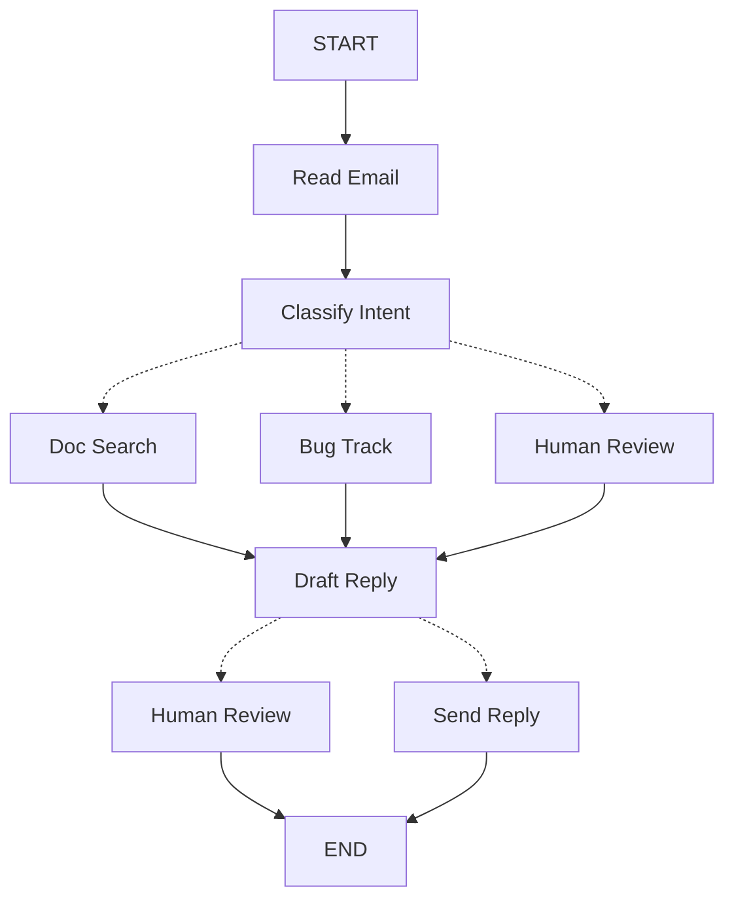

LangGraph 可以改变您构建代理的思维方式。当您使用 LangGraph 构建代理时，您首先会将其分解为称为**节点**的离散步骤。然后，您将描述每个节点的不同决策和转换。最后，您将通过共享**状态**将节点连接在一起，每个节点都可以从中读取和写入。在本教程中，我们将指导您完成使用 LangGraph 构建客户支持邮件代理的思维过程。

## 从您想要自动化的流程开始

假设您需要构建一个处理客户支持邮件的 AI 代理。您的产品团队给了您以下要求：

代理应该：

- 阅读传入的客户邮件
- 按紧急程度和主题对它们进行分类
- 搜索相关文档以回答问题
- 起草适当的回复
- 将复杂问题升级给人工代理
- 在需要时安排后续跟进

需要处理的示例场景：

1. 简单的产品问题："如何重置我的密码？"
2. 错误报告："当我选择 PDF 格式时，导出功能崩溃"
3. 紧急计费问题："我的订阅被扣了两次费！"
4. 功能请求："你能在移动应用中添加深色模式吗？"
5. 复杂的技术问题："我们的 API 集成间歇性地失败，出现 504 错误"

要在 LangGraph 中实现代理，您通常会遵循相同的五个步骤。

## 步骤 1：将工作流映射为离散步骤

首先识别流程中的不同步骤。每个步骤将成为一个**节点**（执行一个特定功能的函数）。然后勾画这些步骤如何相互连接。



箭头显示可能的路径，但实际选择哪条路径的决策发生在每个节点内部。

既然您已经识别了工作流中的组件，让我们了解每个节点需要做什么：

- 阅读邮件：提取和解析邮件内容
- 分类意图：使用 LLM 对紧急程度和主题进行分类，然后路由到适当的操作
- 文档搜索：查询您的知识库以获取相关信息
- 错误跟踪：在跟踪系统中创建或更新问题
- 起草回复：生成适当的回复
- 人工审查：升级给人工代理进行批准或处理
- 发送回复：发送邮件回复

<Tip>
请注意，某些节点会决定下一步去哪里（分类意图、起草回复、人工审查），而其他节点总是继续到相同的下一步（阅读邮件总是转到分类意图，文档搜索总是转到起草回复）。
</Tip>

## 步骤 2：识别每个步骤需要做什么

对于图中的每个节点，确定它代表什么类型的操作以及它需要什么上下文才能正常工作。

<CardGroup cols={2}>
    <Card title="LLM 步骤" icon="brain" href="#llm-steps">
        当您需要理解、分析、生成文本或做出推理决策时使用
    </Card>
    <Card title="数据步骤" icon="database" href="#data-steps">
        当您需要从外部源检索信息时使用
    </Card>
    <Card title="操作步骤" icon="bolt" href="#action-steps">
        当您需要执行外部操作时使用
    </Card>
    <Card title="用户输入步骤" icon="user" href="#user-input-steps">
        当您需要人工干预时使用
    </Card>
</CardGroup>

### LLM 步骤

当步骤需要理解、分析、生成文本或做出推理决策时：

<AccordionGroup>
    <Accordion title="分类意图节点">
        - 静态上下文（提示）：分类类别、紧急程度定义、响应格式
        - 动态上下文（来自状态）：邮件内容、发件人信息
        - 期望结果：确定路由的结构化分类
    </Accordion>

    <Accordion title="起草回复节点">
        - 静态上下文（提示）：语调指南、公司政策、响应模板
        - 动态上下文（来自状态）：分类结果、搜索结果、客户历史
        - 期望结果：准备审查的专业邮件回复
    </Accordion>
</AccordionGroup>

### 数据步骤

当步骤需要从外部源检索信息时：

<AccordionGroup>
    <Accordion title="文档搜索节点">
        - 参数：从意图和主题构建的查询
        - 重试策略：是，对临时故障使用指数退避
        - 缓存：可以缓存常见查询以减少 API 调用
    </Accordion>

    <Accordion title="客户历史查找">
        - 参数：来自状态的客户邮件或 ID
        - 重试策略：是，但如果不可用则回退到基本信息
        - 缓存：是，使用生存时间以平衡新鲜度和性能
    </Accordion>
</AccordionGroup>

### 操作步骤

当步骤需要执行外部操作时：

<AccordionGroup>
    <Accordion title="发送回复节点">
        - 何时执行：批准后（人工或自动）
        - 重试策略：是，对网络问题使用指数退避
        - 不应缓存：每次发送都是唯一的操作
    </Accordion>

    <Accordion title="错误跟踪节点">
        - 何时执行：当意图为"bug"时始终执行
        - 重试策略：是，关键是不丢失错误报告
        - 返回：要在响应中包含的工单 ID
    </Accordion>
</AccordionGroup>

### 用户输入步骤

当步骤需要人工干预时：

<AccordionGroup>
    <Accordion title="人工审查节点">
        - 决策上下文：原始邮件、草稿回复、紧急程度、分类
        - 预期输入格式：批准布尔值加上可选的编辑回复
        - 何时触发：高紧急程度、复杂问题或质量问题
    </Accordion>
</AccordionGroup>

## 步骤 3：设计您的状态

状态是代理中所有节点都可以访问的共享[内存](/oss/javascript/concepts/memory)。将其视为您的代理用来跟踪它在处理过程中学习和决定的一切的笔记本。

### 什么应该属于状态？

对于每个数据片段，问自己这些问题：

<CardGroup cols={2}>
    <Card title="包含在状态中" icon="check">
        它需要在步骤之间持久化吗？如果是，它应该放在状态中。
    </Card>

    <Card title="不存储" icon="code">
        您可以从其他数据中推导出它吗？如果是，在需要时计算它，而不是将其存储在状态中。
    </Card>
</CardGroup>

对于我们的邮件代理，我们需要跟踪：

- 原始邮件和发件人信息（无法重建这些）
- 分类结果（多个下游节点需要）
- 搜索结果和客户数据（重新获取成本高）
- 草稿回复（需要在审查过程中持久化）
- 执行元数据（用于调试和恢复）

### 保持状态原始，按需格式化提示

<Tip>
一个关键原则：您的状态应该存储原始数据，而不是格式化的文本。在需要时在节点内部格式化提示。
</Tip>

这种分离意味着：

- 不同的节点可以根据需要以不同方式格式化相同的数据
- 您可以更改提示模板而无需修改状态模式
- 调试更清晰 - 您可以看到每个节点接收的确切数据
- 您的代理可以演进而不会破坏现有状态

让我们定义我们的状态：


```typescript
import * as z from "zod";

// Define the structure for email classification
const EmailClassificationSchema = z.object({
  intent: z.enum(["question", "bug", "billing", "feature", "complex"]),
  urgency: z.enum(["low", "medium", "high", "critical"]),
  topic: z.string(),
  summary: z.string(),
});

const EmailAgentState = z.object({
  // Raw email data
  emailContent: z.string(),
  senderEmail: z.string(),
  emailId: z.string(),

  // Classification result
  classification: EmailClassificationSchema.optional(),

  // Raw search/API results
  searchResults: z.array(z.string()).optional(),  // List of raw document chunks
  customerHistory: z.record(z.any()).optional(),  // Raw customer data from CRM

  // Generated content
  responseText: z.string().optional(),
});

type EmailAgentStateType = z.infer<typeof EmailAgentState>;
type EmailClassificationType = z.infer<typeof EmailClassificationSchema>;
```


请注意，状态仅包含原始数据 - 没有提示模板、没有格式化的字符串、没有指令。分类输出存储为单个字典，直接来自 LLM。

## 步骤 4：构建您的节点


现在我们将每个步骤实现为一个函数。LangGraph 中的节点只是一个接受当前状态并返回对其更新的 JavaScript 函数。


### 适当处理错误

不同的错误需要不同的处理策略：

| 错误类型 | 谁修复 | 策略 | 何时使用 |
|------------|--------------|----------|-------------|
| 临时错误（网络问题、速率限制） | 系统（自动） | 重试策略 | 通常在重试时解决的临时故障 |
| LLM 可恢复的错误（工具故障、解析问题） | LLM | 将错误存储在状态中并循环返回 | LLM 可以看到错误并调整其方法 |
| 用户可修复的错误（缺少信息、指令不明确） | 人工 | 使用 `interrupt()` 暂停 | 需要用户输入才能继续 |
| 意外错误 | 开发人员 | 让它们冒泡 | 需要调试的未知问题 |

<Tabs>
    <Tab title="临时错误" icon="rotate">
        添加重试策略以自动重试网络问题和速率限制：


    ```typescript
    import type { RetryPolicy } from "@langchain/langgraph";

    workflow.addNode(
    "searchDocumentation",
    searchDocumentation,
    {
        retryPolicy: { maxAttempts: 3, initialInterval: 1.0 },
    },
    );
    ```


    </Tab>

    <Tab title="LLM 可恢复" icon="brain">
        将错误存储在状态中并循环返回，以便 LLM 可以看到出了什么问题并重试：


    ```typescript
    import { Command } from "@langchain/langgraph";

    async function executeTool(state: State) {
    try {
        const result = await runTool(state.toolCall);
        return new Command({
        update: { toolResult: result },
        goto: "agent",
        });
    } catch (error) {
        // Let the LLM see what went wrong and try again
        return new Command({
        update: { toolResult: `Tool error: ${error}` },
        goto: "agent"
        });
    }
    }
    ```


    </Tab>

    <Tab title="用户可修复" icon="user">
        在需要时暂停并从用户那里收集信息（如账户 ID、订单号或澄清）：


    ```typescript
    import { Command, interrupt } from "@langchain/langgraph";

    async function lookupCustomerHistory(state: State) {
    if (!state.customerId) {
        const userInput = interrupt({
        message: "Customer ID needed",
        request: "Please provide the customer's account ID to look up their subscription history",
        });
        return new Command({
        update: { customerId: userInput.customerId },
        goto: "lookupCustomerHistory",
        });
    }
    // Now proceed with the lookup
    const customerData = await fetchCustomerHistory(state.customerId);
    return new Command({
        update: { customerHistory: customerData },
        goto: "draftResponse",
    });
    }
    ```


    </Tab>

    <Tab title="意外" icon="triangle-exclamation">
        让它们冒泡以便调试。不要捕获您无法处理的内容：


    ```typescript
    async function sendReply(state: EmailAgentStateType): Promise<void> {
    try {
        await emailService.send(state.responseText);
    } catch (error) {
        throw error;  // Surface unexpected errors
    }
    }
    ```


    </Tab>
</Tabs>


### 实现我们的邮件代理节点

我们将每个节点实现为一个简单的函数。记住：节点接受状态，执行工作，并返回更新。

<AccordionGroup>
    <Accordion title="阅读和分类节点" icon="brain">


    ```typescript
    import { StateGraph, START, END, Command } from "@langchain/langgraph";
    import { HumanMessage } from "@langchain/core/messages";
    import { ChatAnthropic } from "@langchain/anthropic";

    const llm = new ChatAnthropic({ model: "claude-sonnet-4-5-20250929" });

    async function readEmail(state: EmailAgentStateType) {
    // 提取和解析邮件内容
    // 在生产环境中，这将连接到您的邮件服务
    console.log(`Processing email: ${state.emailContent}`);
    return {};
    }

    async function classifyIntent(state: EmailAgentStateType) {
    // 使用 LLM 对邮件意图和紧急程度进行分类，然后相应路由

    // 创建返回 EmailClassification 对象的结构化 LLM
    const structuredLlm = llm.withStructuredOutput(EmailClassificationSchema);

    // 按需格式化提示，不存储在状态中
    const classificationPrompt = `
    Analyze this customer email and classify it:

    Email: ${state.emailContent}
    From: ${state.senderEmail}

    Provide classification including intent, urgency, topic, and summary.
    `;

    // 直接获取结构化响应作为对象
    const classification = await structuredLlm.invoke(classificationPrompt);

    // 根据分类确定下一个节点
    let nextNode: "searchDocumentation" | "humanReview" | "draftResponse" | "bugTracking";

    if (classification.intent === "billing" || classification.urgency === "critical") {
        nextNode = "humanReview";
    } else if (classification.intent === "question" || classification.intent === "feature") {
        nextNode = "searchDocumentation";
    } else if (classification.intent === "bug") {
        nextNode = "bugTracking";
    } else {
        nextNode = "draftResponse";
    }

    // 将分类作为单个对象存储在状态中
    return new Command({
        update: { classification },
        goto: nextNode,
    });
    }
    ```


    </Accordion>

    <Accordion title="搜索和跟踪节点" icon="database">


    ```typescript
    async function searchDocumentation(state: EmailAgentStateType) {
    // 搜索知识库以获取相关信息

    // 从分类构建搜索查询
    const classification = state.classification!;
    const query = `${classification.intent} ${classification.topic}`;

    let searchResults: string[];

    try {
        // 在此处实现您的搜索逻辑
        // 存储原始搜索结果，而不是格式化的文本
        searchResults = [
        "Reset password via Settings > Security > Change Password",
        "Password must be at least 12 characters",
        "Include uppercase, lowercase, numbers, and symbols",
        ];
    } catch (error) {
        // 对于可恢复的搜索错误，存储错误并继续
        searchResults = [`Search temporarily unavailable: ${error}`];
    }

    return new Command({
        update: { searchResults },  // 存储原始结果或错误
        goto: "draftResponse",
    });
    }

    async function bugTracking(state: EmailAgentStateType) {
    // 创建或更新错误跟踪工单

    // 在您的错误跟踪系统中创建工单
    const ticketId = "BUG-12345";  // 将通过 API 创建

    return new Command({
        update: { searchResults: [`Bug ticket ${ticketId} created`] },
        goto: "draftResponse",
    });
    }
    ```


    </Accordion>

    <Accordion title="响应节点" icon="pen-to-square">


    ```typescript
    import { Command, interrupt } from "@langchain/langgraph";

    async function draftResponse(state: EmailAgentStateType) {
    // 使用上下文生成响应并根据质量路由

    const classification = state.classification!;

    // 按需从原始状态数据格式化上下文
    const contextSections: string[] = [];

    if (state.searchResults) {
        // 为提示格式化搜索结果
        const formattedDocs = state.searchResults.map(doc => `- ${doc}`).join("\n");
        contextSections.push(`Relevant documentation:\n${formattedDocs}`);
    }

    if (state.customerHistory) {
        // 为提示格式化客户数据
        contextSections.push(`Customer tier: ${state.customerHistory.tier ?? "standard"}`);
    }

    // 使用格式化的上下文构建提示
    const draftPrompt = `
    Draft a response to this customer email:
    ${state.emailContent}

    Email intent: ${classification.intent}
    Urgency level: ${classification.urgency}

    ${contextSections.join("\n\n")}

    Guidelines:
    - Be professional and helpful
    - Address their specific concern
    - Use the provided documentation when relevant
    `;

    const response = await llm.invoke([new HumanMessage(draftPrompt)]);

    // 根据紧急程度和意图确定是否需要人工审查
    const needsReview = (
        classification.urgency === "high" ||
        classification.urgency === "critical" ||
        classification.intent === "complex"
    );

    // 路由到适当的下一个节点
    const nextNode = needsReview ? "humanReview" : "sendReply";

    return new Command({
        update: { responseText: response.content.toString() },  // 仅存储原始响应
        goto: nextNode,
    });
    }

    async function humanReview(state: EmailAgentStateType) {
    // 使用中断暂停以进行人工审查并根据决策路由
    const classification = state.classification!;

    // interrupt() 必须首先执行 - 在它之前的任何代码都会在恢复时重新运行
    const humanDecision = interrupt({
        emailId: state.emailId,
        originalEmail: state.emailContent,
        draftResponse: state.responseText,
        urgency: classification.urgency,
        intent: classification.intent,
        action: "Please review and approve/edit this response",
    });

    // 现在处理人工的决策
    if (humanDecision.approved) {
        return new Command({
        update: { responseText: humanDecision.editedResponse || state.responseText },
        goto: "sendReply",
        });
    } else {
        // 拒绝意味着人工将直接处理
        return new Command({ update: {}, goto: END });
    }
    }

    async function sendReply(state: EmailAgentStateType): Promise<{}> {
    // 发送邮件回复
    // 与邮件服务集成
    console.log(`Sending reply: ${state.responseText!.substring(0, 100)}...`);
    return {};
    }
    ```


    </Accordion>
</AccordionGroup>

## 步骤 5：将它们连接在一起

现在我们将节点连接成一个工作图。由于我们的节点处理自己的路由决策，我们只需要一些基本边。

要使用 `interrupt()` 启用[人在回路](/oss/javascript/langgraph/interrupts)，我们需要使用[检查点保存器](/oss/javascript/langgraph/persistence)进行编译，以便在运行之间保存状态：

<Accordion title="图编译代码" icon="diagram-project" defaultOpen={true}>


```typescript
import { MemorySaver, RetryPolicy } from "@langchain/langgraph";

// 创建图
const workflow = new StateGraph(EmailAgentState)
  // 添加具有适当错误处理的节点
  .addNode("readEmail", readEmail)
  .addNode("classifyIntent", classifyIntent)
  // 为可能有临时故障的节点添加重试策略
  .addNode(
    "searchDocumentation",
    searchDocumentation,
    { retryPolicy: { maxAttempts: 3 } },
  )
  .addNode("bugTracking", bugTracking)
  .addNode("draftResponse", draftResponse)
  .addNode("humanReview", humanReview)
  .addNode("sendReply", sendReply)
  // 仅添加基本边
  .addEdge(START, "readEmail")
  .addEdge("readEmail", "classifyIntent")
  .addEdge("sendReply", END);

// 使用检查点保存器编译以进行持久化
const memory = new MemorySaver();
const app = workflow.compile({ checkpointer: memory });
```


</Accordion>


图结构是最小的，因为路由通过 `Command` 对象在节点内部发生。每个节点声明它可以去哪里，使流程明确且可追踪。


### 试用您的代理

让我们运行我们的代理，处理一个需要人工审查的紧急计费问题：

<Accordion title="测试代理" icon="flask">


```typescript
// 使用紧急计费问题测试
const initialState: EmailAgentStateType = {
  emailContent: "I was charged twice for my subscription! This is urgent!",
  senderEmail: "customer@example.com",
  emailId: "email_123"
};

// 使用 thread_id 运行以进行持久化
const config = { configurable: { thread_id: "customer_123" } };
const result = await app.invoke(initialState, config);
// 图将在 human_review 处暂停
console.log(`Draft ready for review: ${result.responseText?.substring(0, 100)}...`);

// 准备就绪后，提供人工输入以恢复
import { Command } from "@langchain/langgraph";

const humanResponse = new Command({
  resume: {
    approved: true,
    editedResponse: "We sincerely apologize for the double charge. I've initiated an immediate refund...",
  }
});

// 恢复执行
const finalResult = await app.invoke(humanResponse, config);
console.log("Email sent successfully!");
```


</Accordion>

当图遇到 `interrupt()` 时，它会暂停，将所有内容保存到检查点保存器，然后等待。它可以在几天后恢复，从停止的地方准确继续。`thread_id` 确保此对话的所有状态都一起保存。

## 总结和后续步骤

### 关键见解

构建这个邮件代理向我们展示了 LangGraph 的思维方式：

<CardGroup cols={2}>
    <Card title="分解为离散步骤" icon="sitemap" href="#step-1-map-out-your-workflow-as-discrete-steps">
        每个节点都做好一件事。这种分解支持流式进度更新、可以暂停和恢复的持久执行，以及清晰的调试，因为您可以在步骤之间检查状态。
    </Card>

    <Card title="状态是共享内存" icon="database" href="#step-3-design-your-state">
        存储原始数据，而不是格式化的文本。这让不同的节点以不同的方式使用相同的信息。
    </Card>

    <Card title="节点是函数" icon="code" href="#step-4-build-your-nodes">
        它们接受状态，执行工作，并返回更新。当它们需要做出路由决策时，它们指定状态更新和下一个目标。
    </Card>

    <Card title="错误是流程的一部分" icon="triangle-exclamation" href="#handle-errors-appropriately">
        临时故障会重试，LLM 可恢复的错误会带着上下文循环返回，用户可修复的问题会暂停等待输入，意外错误会冒泡以便调试。
    </Card>

    <Card title="人工输入是一等公民" icon="user" href="/oss/javascript/langgraph/interrupts">
        `interrupt()` 函数无限期暂停执行，保存所有状态，并在您提供输入时从停止的地方准确恢复。当与节点中的其他操作结合时，它必须首先执行。
    </Card>

    <Card title="图结构自然出现" icon="diagram-project" href="#step-5-wire-it-together">
        您定义基本连接，您的节点处理自己的路由逻辑。这使控制流明确且可追踪 - 您总是可以通过查看当前节点来理解您的代理下一步将做什么。
    </Card>
</CardGroup>

### 高级考虑

<Accordion title="节点粒度权衡" icon="sliders">
<Info>
本节探讨节点粒度设计的权衡。大多数应用程序可以跳过此部分并使用上面显示的模式。
</Info>

您可能想知道：为什么不将 `Read Email` 和 `Classify Intent` 合并为一个节点？

或者为什么将 Doc Search 与 Draft Reply 分开？

答案涉及弹性和可观测性之间的权衡。

**弹性考虑：** LangGraph 的[持久执行](/oss/javascript/langgraph/durable-execution)在节点边界创建检查点。当工作流在中断或故障后恢复时，它从执行停止的节点开始处开始。较小的节点意味着更频繁的检查点，这意味着如果出现问题，需要重复的工作更少。如果您将多个操作合并为一个大型节点，接近结束时的故障意味着从该节点的开始处重新执行所有内容。

我们为邮件代理选择这种分解的原因：

- **外部服务的隔离：** Doc Search 和 Bug Track 是单独的节点，因为它们调用外部 API。如果搜索服务缓慢或失败，我们希望将其与 LLM 调用隔离。我们可以为这些特定节点添加重试策略，而不影响其他节点。

- **中间可见性：** 将 `Classify Intent` 作为自己的节点，让我们可以在采取行动之前检查 LLM 的决定。这对于调试和监控很有价值 - 您可以准确看到代理何时以及为什么路由到人工审查。

- **不同的故障模式：** LLM 调用、数据库查找和邮件发送具有不同的重试策略。单独的节点让您可以独立配置这些。

- **可重用性和测试：** 较小的节点更容易单独测试并在其他工作流中重用。

另一种有效方法：您可以将 `Read Email` 和 `Classify Intent` 合并为单个节点。您将失去在分类之前检查原始邮件的能力，并且在该节点的任何故障上都会重复这两个操作。对于大多数应用程序，单独节点的可观测性和调试好处值得这种权衡。

应用程序级别的关注：步骤 2 中的缓存讨论（是否缓存搜索结果）是应用程序级别的决策，而不是 LangGraph 框架功能。您根据特定要求在节点函数内实现缓存 - LangGraph 不规定这一点。

性能考虑：更多节点并不意味着执行更慢。LangGraph 默认在后台写入检查点（[异步持久性模式](/oss/javascript/langgraph/durable-execution#durability-modes)），因此您的图继续运行而不等待检查点完成。这意味着您获得频繁的检查点，而性能影响最小。如果需要，您可以调整此行为 - 使用 `"exit"` 模式仅在完成时检查点，或使用 `"sync"` 模式阻止执行直到写入每个检查点。
</Accordion>

### 从这里开始

这是使用 LangGraph 构建代理的思维模式介绍。您可以使用以下内容扩展此基础：

<CardGroup cols={2}>
    <Card title="人在回路模式" icon="user-check" href="/oss/javascript/langgraph/interrupts">
        学习如何在执行前添加工具批准、批量批准和其他模式
    </Card>

    <Card title="子图" icon="diagram-nested" href="/oss/javascript/langgraph/use-subgraphs">
        为复杂的多步骤操作创建子图
    </Card>

    <Card title="流式传输" icon="tower-broadcast" href="/oss/javascript/langgraph/streaming">
        添加流式传输以向用户显示实时进度
    </Card>

    <Card title="可观测性" icon="chart-line" href="/oss/javascript/langgraph/observability">
        使用 LangSmith 添加可观测性以进行调试和监控
    </Card>

    <Card title="工具集成" icon="wrench" href="/oss/javascript/langchain/tools">
        集成更多工具用于网络搜索、数据库查询和 API 调用
    </Card>

    <Card title="重试逻辑" icon="rotate" href="/oss/javascript/langgraph/use-graph-api#add-retry-policies">
        为失败的操作实现带指数退避的重试逻辑
    </Card>
</CardGroup>

---

<Callout icon="pen-to-square" iconType="regular">
    [Edit the source of this page on GitHub.](https://github.com/langchain-ai/docs/edit/main/src/oss\langgraph\thinking-in-langgraph.mdx)
</Callout>
<Tip icon="terminal" iconType="regular">
    [Connect these docs programmatically](/use-these-docs) to Claude, VSCode, and more via MCP for real-time answers.
</Tip>
