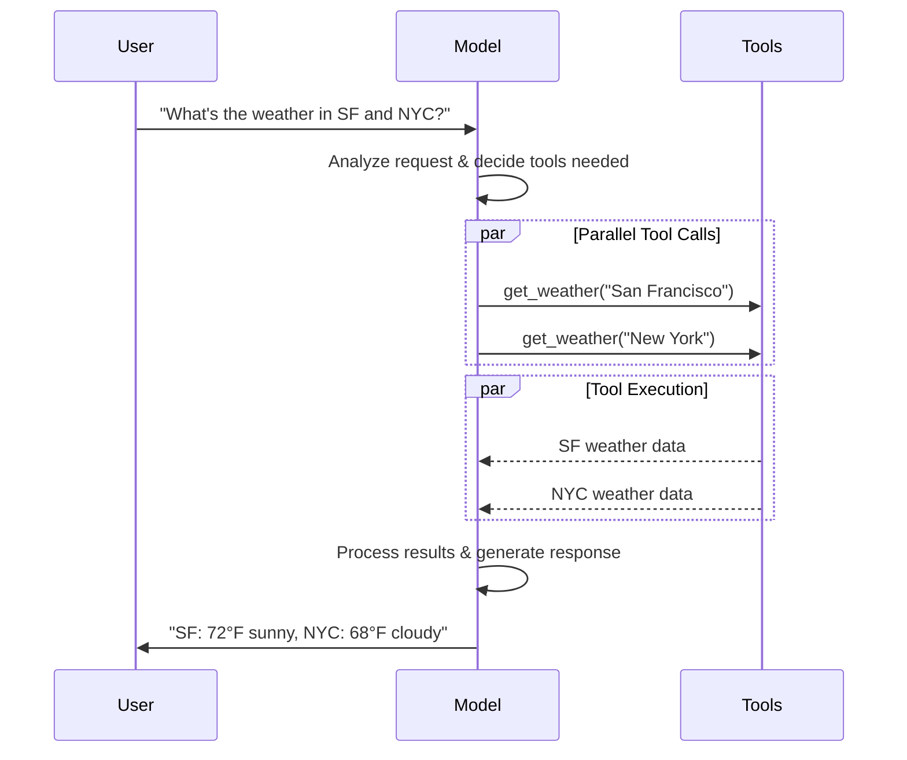

import ChatModelTabsPy from '/snippets/chat-model-tabs.mdx';
import ChatModelTabsJS from '/snippets/chat-model-tabs-js.mdx';

[LLM](https://en.wikipedia.org/wiki/Large_language_model) 是强大的 AI 工具，可以像人类一样解释和生成文本。它们足够通用，可以编写内容、翻译语言、总结和回答问题，而无需为每个任务进行专门训练。

除了文本生成，许多模型还支持：

* <Icon icon="hammer" size={16} /> [工具调用](#tool-calling) - 调用外部工具（如数据库查询或 API 调用）并在响应中使用结果。
* <Icon icon="shapes" size={16} /> [结构化输出](#structured-output) - 模型的响应被约束为遵循定义的格式。
* <Icon icon="image" size={16} /> [多模态](#multimodal) - 处理和返回文本以外的数据，如图像、音频和视频。
* <Icon icon="brain" size={16} /> [推理](#reasoning) - 模型执行多步推理以得出结论。

模型是[智能体](/oss/python/langchain/agents)的推理引擎。它们驱动智能体的决策过程，决定调用哪些工具、如何解释结果以及何时提供最终答案。

您选择的模型的质量和能力直接影响智能体的可靠性和性能。不同的模型擅长不同的任务——有些更擅长遵循复杂指令，有些更擅长结构化推理，有些支持更大的上下文窗口以处理更多信息。

LangChain 的标准模型接口让您可以访问许多不同的提供者集成，这使得实验和切换模型以找到最适合您用例的模型变得容易。

<Info>
    有关特定提供者的集成信息和功能，请参阅提供者的[聊天模型页面](/oss/python/integrations/chat)。
</Info>

## 基本用法

模型可以通过两种方式使用：

1. **与智能体一起** - 在创建[智能体](/oss/python/langchain/agents#model)时可以动态指定模型。
2. **独立使用** - 可以直接调用模型（在智能体循环之外）用于文本生成、分类或提取等任务，而无需智能体框架。

相同的模型接口在两种上下文中都有效，这使您可以灵活地从简单开始，并根据需要扩展到更复杂的基于智能体的工作流。

### 初始化模型

在 LangChain 中开始使用独立模型的最简单方法是使用 [`init_chat_model`](https://reference.langchain.com/python/langchain/models/#langchain.chat_models.init_chat_model) 从您选择的[聊天模型提供者](/oss/python/integrations/chat)初始化一个（下面的示例）：

<ChatModelTabsPy />
```python
response = model.invoke("Why do parrots talk?")
```

更多详细信息，请参阅 [`init_chat_model`](https://reference.langchain.com/python/langchain/models/#langchain.chat_models.init_chat_model)，包括如何传递模型[参数](#parameters)的信息。


### 关键方法

<Card title="Invoke" href="#invoke" icon="paper-plane" arrow="true" horizontal>
    模型接受消息作为输入，并在生成完整响应后输出消息。
</Card>
<Card title="Stream" href="#stream" icon="tower-broadcast" arrow="true" horizontal>
    调用模型，但在生成时实时流式传输输出。
</Card>
<Card title="Batch" href="#batch" icon="grip" arrow="true" horizontal>
    批量向模型发送多个请求以进行更高效的处理。
</Card>

<Info>
    除了聊天模型，LangChain 还提供对其他相邻技术的支持，如嵌入模型和向量存储。详细信息，请参阅[集成页面](/oss/python/integrations/providers/overview)。
</Info>

## 参数

聊天模型接受可用于配置其行为的参数。支持的完整参数集因模型和提供者而异，但标准参数包括：

<ParamField body="model" type="string" required>
    您想与提供者一起使用的特定模型的名称或标识符。
</ParamField>

<ParamField body="api_key" type="string">
    与模型提供者进行身份验证所需的密钥。这通常在您注册访问模型时颁发。通常通过设置<Tooltip tip="值在程序外部设置的变量，通常通过操作系统或微服务内置的功能。">环境变量</Tooltip>来访问。
</ParamField>


<ParamField body="temperature" type="number">
    控制模型输出的随机性。数字越高，响应越有创意；数字越低，响应越确定性。
</ParamField>

<ParamField body="timeout" type="number">
    在取消请求之前等待模型响应的最长时间（以秒为单位）。
</ParamField>

<ParamField body="max_tokens" type="number">
    限制响应中<Tooltip tip="模型读取和生成的基本单位。提供者可能以不同方式定义它们，但通常，它们可以表示整个或部分单词。">令牌</Tooltip>的总数，有效控制输出的长度。
</ParamField>

<ParamField body="max_retries" type="number">
    如果由于网络超时或速率限制等问题而失败，系统将尝试重新发送请求的最大次数。
</ParamField>


使用 [`init_chat_model`](https://reference.langchain.com/python/langchain/models/#langchain.chat_models.init_chat_model)，将这些参数作为内联<Tooltip tip="任意关键字参数" cta="了解更多" href="https://www.w3schools.com/python/python_args_kwargs.asp">`**kwargs`</Tooltip>传递：

```python Initialize using model parameters
model = init_chat_model(
    "claude-sonnet-4-5-20250929",
    # Kwargs passed to the model:
    temperature=0.7,
    timeout=30,
    max_tokens=1000,
)
```


<Info>
    每个聊天模型集成可能有用于控制提供者特定功能的附加参数。例如，[`ChatOpenAI`](https://reference.langchain.com/python/integrations/langchain_openai/ChatOpenAI) 有 `use_responses_api` 来指示是使用 OpenAI Responses 还是 Completions API。

    要查找给定聊天模型支持的所有参数，请访问[聊天模型集成](/oss/python/integrations/chat)页面。
</Info>

---

## 调用

必须调用聊天模型才能生成输出。有三种主要的调用方法，每种都适用于不同的用例。

### Invoke

调用模型最直接的方法是使用 [`invoke()`](https://reference.langchain.com/python/langchain_core/language_models/#langchain_core.language_models.chat_models.BaseChatModel.invoke) 和单个消息或消息列表。

```python Single message
response = model.invoke("Why do parrots have colorful feathers?")
print(response)
```


可以向模型提供消息列表以表示对话历史。每条消息都有一个角色，模型使用该角色来指示谁在对话中发送了消息。有关角色、类型和内容的更多详细信息，请参阅[消息](/oss/python/langchain/messages)指南。

```python Dictionary format
conversation = [
    {"role": "system", "content": "You are a helpful assistant that translates English to French."},
    {"role": "user", "content": "Translate: I love programming."},
    {"role": "assistant", "content": "J'adore la programmation."},
    {"role": "user", "content": "Translate: I love building applications."}
]

response = model.invoke(conversation)
print(response)  # AIMessage("J'adore créer des applications.")
```
```python Message objects
from langchain.messages import HumanMessage, AIMessage, SystemMessage

conversation = [
    SystemMessage("You are a helpful assistant that translates English to French."),
    HumanMessage("Translate: I love programming."),
    AIMessage("J'adore la programmation."),
    HumanMessage("Translate: I love building applications.")
]

response = model.invoke(conversation)
print(response)  # AIMessage("J'adore créer des applications.")
```


### Stream

大多数模型可以在生成输出内容时流式传输。通过逐步显示输出，流式传输显著改善了用户体验，特别是对于较长的响应。

调用 [`stream()`](https://reference.langchain.com/python/langchain_core/language_models/#langchain_core.language_models.chat_models.BaseChatModel.stream) 返回一个<Tooltip tip="一个逐步提供对集合中每个项目访问的对象，按顺序。">迭代器</Tooltip>，在生成时产生输出块。您可以使用循环实时处理每个块：

<CodeGroup>
    ```python Basic text streaming
    for chunk in model.stream("Why do parrots have colorful feathers?"):
        print(chunk.text, end="|", flush=True)
    ```

    ```python Stream tool calls, reasoning, and other content
    for chunk in model.stream("What color is the sky?"):
        for block in chunk.content_blocks:
            if block["type"] == "reasoning" and (reasoning := block.get("reasoning")):
                print(f"Reasoning: {reasoning}")
            elif block["type"] == "tool_call_chunk":
                print(f"Tool call chunk: {block}")
            elif block["type"] == "text":
                print(block["text"])
            else:
                ...
    ```
</CodeGroup>


与 [`invoke()`](#invoke) 相反，它在模型完成生成完整响应后返回单个 [`AIMessage`](https://reference.langchain.com/python/langchain/messages/#langchain.messages.AIMessage)，`stream()` 返回多个 [`AIMessageChunk`](https://reference.langchain.com/python/langchain/messages/#langchain.messages.AIMessageChunk) 对象，每个对象包含输出文本的一部分。重要的是，流中的每个块都设计为通过求和聚合成完整消息：

```python Construct an AIMessage
full = None  # None | AIMessageChunk
for chunk in model.stream("What color is the sky?"):
    full = chunk if full is None else full + chunk
    print(full.text)

# The
# The sky
# The sky is
# The sky is typically
# The sky is typically blue
# ...

print(full.content_blocks)
# [{"type": "text", "text": "The sky is typically blue..."}]
```


生成的消息可以与使用 [`invoke()`](#invoke) 生成的消息相同的方式处理——例如，它可以聚合到消息历史中，并作为对话上下文传递回模型。

<Warning>
    只有当程序中的所有步骤都知道如何处理块流时，流式传输才有效。例如，不支持流式传输的应用程序是需要在处理之前将整个输出存储在内存中的应用程序。
</Warning>

<Accordion title="Advanced streaming topics">
    <Accordion title='"Auto-streaming" chat models'>
        LangChain 通过在某些情况下自动启用流式传输模式来简化从聊天模型的流式传输，即使您没有显式调用流式传输方法。当您使用非流式传输的 invoke 方法但仍想流式传输整个应用程序（包括来自聊天模型的中间结果）时，这特别有用。

        例如，在 [LangGraph 智能体](/oss/python/langchain/agents)中，您可以在节点内调用 `model.invoke()`，但如果以流式传输模式运行，LangChain 将自动委托给流式传输。

        #### How it works

        当您 `invoke()` 聊天模型时，如果 LangChain 检测到您正在尝试流式传输整个应用程序，它将自动切换到内部流式传输模式。就使用 invoke 的代码而言，调用的结果将是相同的；但是，在聊天模型被流式传输时，LangChain 将负责在 LangChain 的回调系统中调用 [`on_llm_new_token`](https://reference.langchain.com/python/langchain_core/callbacks/#langchain_core.callbacks.base.AsyncCallbackHandler.on_llm_new_token) 事件。

        Callback events allow LangGraph `stream()` and [`astream_events()`](https://reference.langchain.com/python/langchain_core/language_models/#langchain_core.language_models.chat_models.BaseChatModel.astream_events) to surface the chat model's output in real-time.


    </Accordion>
    <Accordion title="Streaming events">
        LangChain 聊天模型还可以使用 [`astream_events()`](https://reference.langchain.com/python/langchain_core/language_models/#langchain_core.language_models.chat_models.BaseChatModel.astream_events) 流式传输语义事件。

        这简化了基于事件类型和其他元数据的过滤，并将在后台聚合完整消息。请参阅下面的示例。

        ```python
        async for event in model.astream_events("Hello"):

            if event["event"] == "on_chat_model_start":
                print(f"Input: {event['data']['input']}")

            elif event["event"] == "on_chat_model_stream":
                print(f"Token: {event['data']['chunk'].text}")

            elif event["event"] == "on_chat_model_end":
                print(f"Full message: {event['data']['output'].text}")

            else:
                pass
        ```
        ```txt
        Input: Hello
        Token: Hi
        Token:  there
        Token: !
        Token:  How
        Token:  can
        Token:  I
        ...
        Full message: Hi there! How can I help today?
        ```

        <Tip>
            See the [`astream_events()`](https://reference.langchain.com/python/langchain_core/language_models/#langchain_core.language_models.chat_models.BaseChatModel.astream_events) reference for event types and other details.
        </Tip>


    </Accordion>
</Accordion>

### Batch

将独立请求的集合批处理到模型可以显著提高性能并降低成本，因为处理可以并行完成：

```python Batch
responses = model.batch([
    "Why do parrots have colorful feathers?",
    "How do airplanes fly?",
    "What is quantum computing?"
])
for response in responses:
    print(response)
```

<Note>
    本节描述聊天模型方法 [`batch()`](https://reference.langchain.com/python/langchain_core/language_models/#langchain_core.language_models.chat_models.BaseChatModel.batch)，它在客户端并行化模型调用。

    它与推理提供者支持的批处理 API **不同**，例如 [OpenAI](https://platform.openai.com/docs/guides/batch) 或 [Anthropic](https://docs.claude.com/en/docs/build-with-claude/batch-processing#message-batches-api)。
</Note>

默认情况下，[`batch()`](https://reference.langchain.com/python/langchain_core/language_models/#langchain_core.language_models.chat_models.BaseChatModel.batch) 将仅返回整个批处理的最终输出。如果您想在每个单独输入完成生成时接收其输出，可以使用 [`batch_as_completed()`](https://reference.langchain.com/python/langchain_core/language_models/#langchain_core.language_models.chat_models.BaseChatModel.batch_as_completed) 流式传输结果：

```python Yield batch responses upon completion
for response in model.batch_as_completed([
    "Why do parrots have colorful feathers?",
    "How do airplanes fly?",
    "What is quantum computing?"
]):
    print(response)
```
<Note>
    使用 [`batch_as_completed()`](https://reference.langchain.com/python/langchain_core/language_models/#langchain_core.language_models.chat_models.BaseChatModel.batch_as_completed) 时，结果可能不按顺序到达。每个结果都包含输入索引，用于匹配以根据需要重建原始顺序。
</Note>

<Tip>
    使用 [`batch()`](https://reference.langchain.com/python/langchain_core/language_models/#langchain_core.language_models.chat_models.BaseChatModel.batch) 或 [`batch_as_completed()`](https://reference.langchain.com/python/langchain_core/language_models/#langchain_core.language_models.chat_models.BaseChatModel.batch_as_completed) 处理大量输入时，您可能希望控制最大并行调用数。这可以通过在 [`RunnableConfig`](https://reference.langchain.com/python/langchain_core/runnables/#langchain_core.runnables.RunnableConfig) 字典中设置 [`max_concurrency`](https://reference.langchain.com/python/langchain_core/runnables/#langchain_core.runnables.RunnableConfig.max_concurrency) 属性来完成。

    ```python Batch with max concurrency
    model.batch(
        list_of_inputs,
        config={
            'max_concurrency': 5,  # Limit to 5 parallel calls
        }
    )
    ```

    See the [`RunnableConfig`](https://reference.langchain.com/python/langchain_core/runnables/#langchain_core.runnables.RunnableConfig) reference for a full list of supported attributes.
</Tip>

For more details on batching, see the [reference](https://reference.langchain.com/python/langchain_core/language_models/#langchain_core.language_models.chat_models.BaseChatModel.batch).


---

## Tool calling

模型可以请求调用执行任务（如从数据库获取数据、搜索网络或运行代码）的工具。工具是以下内容的配对：

1. 一个模式，包括工具的名称、描述和/或参数定义（通常是 JSON 模式）
2. 要执行的函数或<Tooltip tip="可以暂停执行并在稍后恢复的方法">协程</Tooltip>。

<Note>
    您可能听说过"函数调用"这个术语。我们将其与"工具调用"互换使用。
</Note>

以下是用户和模型之间的基本工具调用流程：




要使您定义的工具可供模型使用，必须使用 [`bind_tools`](https://reference.langchain.com/python/langchain_core/language_models/#langchain_core.language_models.chat_models.BaseChatModel.bind_tools) 绑定它们。在后续调用中，模型可以根据需要选择调用任何绑定的工具。


一些模型提供者提供可以通过模型或调用参数启用的内置工具（例如 [`ChatOpenAI`](/oss/python/integrations/chat/openai)、[`ChatAnthropic`](/oss/python/integrations/chat/anthropic)）。详细信息，请查看相应的[提供者参考](/oss/python/integrations/providers/overview)。

<Tip>
    有关创建工具的详细信息和其他选项，请参阅[工具指南](/oss/python/langchain/tools)。
</Tip>

```python Binding user tools
from langchain.tools import tool

@tool
def get_weather(location: str) -> str:
    """Get the weather at a location."""
    return f"It's sunny in {location}."


model_with_tools = model.bind_tools([get_weather])  # [!code highlight]

response = model_with_tools.invoke("What's the weather like in Boston?")
for tool_call in response.tool_calls:
    # View tool calls made by the model
    print(f"Tool: {tool_call['name']}")
    print(f"Args: {tool_call['args']}")
```


绑定用户定义的工具时，模型的响应包括执行工具的**请求**。当单独使用模型（与[智能体](/oss/python/langchain/agents)分开）时，由您执行请求的工具并将结果返回给模型以用于后续推理。使用[智能体](/oss/python/langchain/agents)时，智能体循环将为您处理工具执行循环。

下面，我们展示一些使用工具调用的常见方法。

<AccordionGroup>
    <Accordion title="Tool execution loop" icon="arrow-rotate-right">
        当模型返回工具调用时，您需要执行工具并将结果传递回模型。这创建了一个对话循环，模型可以使用工具结果生成其最终响应。LangChain 包含[智能体](/oss/python/langchain/agents)抽象，为您处理此编排。

        以下是一个简单的示例：

        ```python Tool execution loop
        # Bind (potentially multiple) tools to the model
        model_with_tools = model.bind_tools([get_weather])

        # Step 1: Model generates tool calls
        messages = [{"role": "user", "content": "What's the weather in Boston?"}]
        ai_msg = model_with_tools.invoke(messages)
        messages.append(ai_msg)

        # Step 2: Execute tools and collect results
        for tool_call in ai_msg.tool_calls:
            # Execute the tool with the generated arguments
            tool_result = get_weather.invoke(tool_call)
            messages.append(tool_result)

        # Step 3: Pass results back to model for final response
        final_response = model_with_tools.invoke(messages)
        print(final_response.text)
        # "The current weather in Boston is 72°F and sunny."
        ```


        Each [`ToolMessage`](https://reference.langchain.com/python/langchain/messages/#langchain.messages.ToolMessage) returned by the tool includes a `tool_call_id` that matches the original tool call, helping the model correlate results with requests.
    </Accordion>
    <Accordion title="Forcing tool calls" icon="asterisk">
        By default, the model has the freedom to choose which bound tool to use based on the user's input. However, you might want to force choosing a tool, ensuring the model uses either a particular tool or **any** tool from a given list:

        <CodeGroup>
            ```python Force use of any tool
            model_with_tools = model.bind_tools([tool_1], tool_choice="any")
            ```
            ```python Force use of specific tools
            model_with_tools = model.bind_tools([tool_1], tool_choice="tool_1")
            ```
        </CodeGroup>


    </Accordion>
    <Accordion title="Parallel tool calls" icon="layer-group">
        Many models support calling multiple tools in parallel when appropriate. This allows the model to gather information from different sources simultaneously.

        ```python Parallel tool calls
        model_with_tools = model.bind_tools([get_weather])

        response = model_with_tools.invoke(
            "What's the weather in Boston and Tokyo?"
        )


        # The model may generate multiple tool calls
        print(response.tool_calls)
        # [
        #   {'name': 'get_weather', 'args': {'location': 'Boston'}, 'id': 'call_1'},
        #   {'name': 'get_weather', 'args': {'location': 'Tokyo'}, 'id': 'call_2'},
        # ]


        # Execute all tools (can be done in parallel with async)
        results = []
        for tool_call in response.tool_calls:
            if tool_call['name'] == 'get_weather':
                result = get_weather.invoke(tool_call)
            ...
            results.append(result)
        ```


        The model intelligently determines when parallel execution is appropriate based on the independence of the requested operations.

        <Tip>
        Most models supporting tool calling enable parallel tool calls by default. Some (including [OpenAI](/oss/python/integrations/chat/openai) and [Anthropic](/oss/python/integrations/chat/anthropic)) allow you to disable this feature. To do this, set `parallel_tool_calls=False`:
        ```python
        model.bind_tools([get_weather], parallel_tool_calls=False)
        ```
        </Tip>
    </Accordion>
    <Accordion title="Streaming tool calls" icon="rss">
        When streaming responses, tool calls are progressively built through [`ToolCallChunk`](https://reference.langchain.com/python/langchain/messages/#langchain.messages.ToolCallChunk). This allows you to see tool calls as they're being generated rather than waiting for the complete response.

        ```python Streaming tool calls
        for chunk in model_with_tools.stream(
            "What's the weather in Boston and Tokyo?"
        ):
            # Tool call chunks arrive progressively
            for tool_chunk in chunk.tool_call_chunks:
                if name := tool_chunk.get("name"):
                    print(f"Tool: {name}")
                if id_ := tool_chunk.get("id"):
                    print(f"ID: {id_}")
                if args := tool_chunk.get("args"):
                    print(f"Args: {args}")

        # Output:
        # Tool: get_weather
        # ID: call_SvMlU1TVIZugrFLckFE2ceRE
        # Args: {"lo
        # Args: catio
        # Args: n": "B
        # Args: osto
        # Args: n"}
        # Tool: get_weather
        # ID: call_QMZdy6qInx13oWKE7KhuhOLR
        # Args: {"lo
        # Args: catio
        # Args: n": "T
        # Args: okyo
        # Args: "}
        ```

        You can accumulate chunks to build complete tool calls:

        ```python Accumulate tool calls
        gathered = None
        for chunk in model_with_tools.stream("What's the weather in Boston?"):
            gathered = chunk if gathered is None else gathered + chunk
            print(gathered.tool_calls)
        ```


    </Accordion>
</AccordionGroup>

---

## Structured output

模型可以被请求以匹配给定模式的格式提供其响应。这对于确保输出可以轻松解析并在后续处理中使用很有用。LangChain 支持多种模式类型和方法来强制执行结构化输出。

<Tabs>
    <Tab title="Pydantic">
        [Pydantic models](https://docs.pydantic.dev/latest/concepts/models/#basic-model-usage) 提供最丰富的功能集，包括字段验证、描述和嵌套结构。

        ```python
        from pydantic import BaseModel, Field

        class Movie(BaseModel):
            """A movie with details."""
            title: str = Field(..., description="The title of the movie")
            year: int = Field(..., description="The year the movie was released")
            director: str = Field(..., description="The director of the movie")
            rating: float = Field(..., description="The movie's rating out of 10")

        model_with_structure = model.with_structured_output(Movie)
        response = model_with_structure.invoke("Provide details about the movie Inception")
        print(response)  # Movie(title="Inception", year=2010, director="Christopher Nolan", rating=8.8)
        ```
    </Tab>
    <Tab title="TypedDict">
        `TypedDict` 使用 Python 的内置类型提供更简单的替代方案，当您不需要运行时验证时是理想的选择。

        ```python
        from typing_extensions import TypedDict, Annotated

        class MovieDict(TypedDict):
            """A movie with details."""
            title: Annotated[str, ..., "The title of the movie"]
            year: Annotated[int, ..., "The year the movie was released"]
            director: Annotated[str, ..., "The director of the movie"]
            rating: Annotated[float, ..., "The movie's rating out of 10"]

        model_with_structure = model.with_structured_output(MovieDict)
        response = model_with_structure.invoke("Provide details about the movie Inception")
        print(response)  # {'title': 'Inception', 'year': 2010, 'director': 'Christopher Nolan', 'rating': 8.8}
        ```
    </Tab>
    <Tab title="JSON Schema">
        For maximum control or interoperability, you can provide a raw JSON Schema.

        ```python
        import json

        json_schema = {
            "title": "Movie",
            "description": "A movie with details",
            "type": "object",
            "properties": {
                "title": {
                    "type": "string",
                    "description": "The title of the movie"
                },
                "year": {
                    "type": "integer",
                    "description": "The year the movie was released"
                },
                "director": {
                    "type": "string",
                    "description": "The director of the movie"
                },
                "rating": {
                    "type": "number",
                    "description": "The movie's rating out of 10"
                }
            },
            "required": ["title", "year", "director", "rating"]
        }

        model_with_structure = model.with_structured_output(
            json_schema,
            method="json_schema",
        )
        response = model_with_structure.invoke("Provide details about the movie Inception")
        print(response)  # {'title': 'Inception', 'year': 2010, ...}
        ```
    </Tab>
</Tabs>


<Note>
    **结构化输出的关键考虑因素：**

    - **方法参数**：某些提供者支持不同的方法（`'json_schema'`、`'function_calling'`、`'json_mode'`）
        - `'json_schema'` 通常指提供者提供的专用结构化输出功能
        - `'function_calling'` 通过强制遵循给定模式的[工具调用](#tool-calling)来派生结构化输出
        - `'json_mode'` 是某些提供者提供的 `'json_schema'` 的前身——它生成有效的 json，但模式必须在提示中描述
    - **包含原始数据**：使用 `include_raw=True` 获取解析的输出和原始 AI 消息
    - **验证**：Pydantic 模型提供自动验证，而 `TypedDict` 和 JSON Schema 需要手动验证
</Note>


<Accordion title="Example: Message output alongside parsed structure">

It can be useful to return the raw [`AIMessage`](https://reference.langchain.com/python/langchain/messages/#langchain.messages.AIMessage) object alongside the parsed representation to access response metadata such as [token counts](#token-usage). To do this, set [`include_raw=True`](https://reference.langchain.com/python/langchain_core/language_models/#langchain_core.language_models.chat_models.BaseChatModel.with_structured_output(include_raw)) when calling [`with_structured_output`](https://reference.langchain.com/python/langchain_core/language_models/#langchain_core.language_models.chat_models.BaseChatModel.with_structured_output):

    ```python
    from pydantic import BaseModel, Field

    class Movie(BaseModel):
        """A movie with details."""
        title: str = Field(..., description="The title of the movie")
        year: int = Field(..., description="The year the movie was released")
        director: str = Field(..., description="The director of the movie")
        rating: float = Field(..., description="The movie's rating out of 10")

    model_with_structure = model.with_structured_output(Movie, include_raw=True)  # [!code highlight]
    response = model_with_structure.invoke("Provide details about the movie Inception")
    response
    # {
    #     "raw": AIMessage(...),
    #     "parsed": Movie(title=..., year=..., ...),
    #     "parsing_error": None,
    # }
    ```


</Accordion>
<Accordion title="Example: Nested structures">
    Schemas can be nested:
    <CodeGroup>
        ```python Pydantic BaseModel
        from pydantic import BaseModel, Field

        class Actor(BaseModel):
            name: str
            role: str

        class MovieDetails(BaseModel):
            title: str
            year: int
            cast: list[Actor]
            genres: list[str]
            budget: float | None = Field(None, description="Budget in millions USD")

        model_with_structure = model.with_structured_output(MovieDetails)
        ```

        ```python TypedDict
        from typing_extensions import Annotated, TypedDict

        class Actor(TypedDict):
            name: str
            role: str

        class MovieDetails(TypedDict):
            title: str
            year: int
            cast: list[Actor]
            genres: list[str]
            budget: Annotated[float | None, ..., "Budget in millions USD"]

        model_with_structure = model.with_structured_output(MovieDetails)
        ```
    </CodeGroup>


</Accordion>

---

## Supported models

LangChain 支持所有主要模型提供者，包括 OpenAI、Anthropic、Google、Azure、AWS Bedrock 等。每个提供者都提供具有不同功能的各种模型。有关 LangChain 中支持的模型的完整列表，请参阅[集成页面](/oss/python/integrations/providers/overview)。

---

## Advanced topics

### Multimodal

某些模型可以处理和返回非文本数据，如图像、音频和视频。您可以通过提供[内容块](/oss/python/langchain/messages#message-content)将非文本数据传递给模型。

<Tip>
    所有具有底层多模态功能的 LangChain 聊天模型都支持：

    1. 跨提供者标准格式的数据（请参阅[我们的消息指南](/oss/python/langchain/messages)）
    2. OpenAI [聊天完成](https://platform.openai.com/docs/api-reference/chat)格式
    3. 特定提供者的任何原生格式（例如，Anthropic 模型接受 Anthropic 原生格式）
</Tip>

详细信息，请参阅消息指南的[多模态部分](/oss/python/langchain/messages#multimodal)。

<Tooltip tip="Not all LLMs are made equally!" cta="See reference" href="https://models.dev/">Some models</Tooltip> 可以返回多模态数据作为其响应的一部分。如果被调用这样做，生成的 [`AIMessage`](https://reference.langchain.com/python/langchain/messages/#langchain.messages.AIMessage) 将具有多模态类型的内容块。

```python Multimodal output
response = model.invoke("Create a picture of a cat")
print(response.content_blocks)
# [
#     {"type": "text", "text": "Here's a picture of a cat"},
#     {"type": "image", "base64": "...", "mime_type": "image/jpeg"},
# ]
```


有关特定提供者的详细信息，请参阅[集成页面](/oss/python/integrations/providers/overview)。

### Reasoning

较新的模型能够执行多步推理以得出结论。这涉及将复杂问题分解为更小、更易管理的步骤。

**如果底层模型支持，**您可以展示此推理过程，以更好地了解模型如何得出最终答案。

<CodeGroup>
    ```python Stream reasoning output
    for chunk in model.stream("Why do parrots have colorful feathers?"):
        reasoning_steps = [r for r in chunk.content_blocks if r["type"] == "reasoning"]
        print(reasoning_steps if reasoning_steps else chunk.text)
    ```

    ```python Complete reasoning output
    response = model.invoke("Why do parrots have colorful feathers?")
    reasoning_steps = [b for b in response.content_blocks if b["type"] == "reasoning"]
    print(" ".join(step["reasoning"] for step in reasoning_steps))
    ```
</CodeGroup>


根据模型，您有时可以指定它应该在推理上投入的努力水平。同样，您可以请求模型完全关闭推理。这可能采用分类的推理"层级"（例如，`'low'` 或 `'high'`）或整数令牌预算的形式。

详细信息，请参阅[集成页面](/oss/python/integrations/providers/overview)或相应聊天模型的[参考](https://reference.langchain.com/python/integrations/)。


### Local models

LangChain 支持在您自己的硬件上本地运行模型。这对于数据隐私至关重要、您想调用自定义模型或当您想避免使用基于云的模型时产生的成本的情况很有用。

[Ollama](/oss/python/integrations/chat/ollama) 是在本地运行模型的最简单方法之一。有关本地集成的完整列表，请参阅[集成页面](/oss/python/integrations/providers/overview)。

### Prompt caching

许多提供者提供提示缓存功能，以减少重复处理相同令牌的延迟和成本。这些功能可以是**隐式**或**显式**：

- **隐式提示缓存**：如果请求命中缓存，提供者将自动传递成本节省。示例：[OpenAI](/oss/python/integrations/chat/openai) 和 [Gemini](/oss/python/integrations/chat/google_generative_ai)（Gemini 2.5 及以上版本）。
- **显式缓存**：提供者允许您手动指示缓存点以获得更大的控制或保证成本节省。示例：[`ChatOpenAI`](https://reference.langchain.com/python/integrations/langchain_openai/ChatOpenAI)（通过 `prompt_cache_key`）、Anthropic 的 [`AnthropicPromptCachingMiddleware`](/oss/python/integrations/chat/anthropic#prompt-caching) 和 [`cache_control`](https://docs.langchain.com/oss/python/integrations/chat/anthropic#prompt-caching) 选项、[AWS Bedrock](/oss/python/integrations/chat/bedrock#prompt-caching)、[Gemini](https://python.langchain.com/api_reference/google_genai/chat_models/langchain_google_genai.chat_models.ChatGoogleGenerativeAI.html)。

<Warning>
    提示缓存通常仅在超过最小输入令牌阈值时才会启用。详细信息，请参阅[提供者页面](/oss/python/integrations/chat)。
</Warning>

缓存使用情况将反映在模型响应的[使用元数据](/oss/python/langchain/messages#token-usage)中。

### Server-side tool use

某些提供者支持服务器端[工具调用](#tool-calling)循环：模型可以与网络搜索、代码解释器和其他工具交互，并在单个对话轮次中分析结果。

如果模型在服务器端调用工具，响应消息的内容将包括表示工具调用和结果的内容。访问响应的[内容块](/oss/python/langchain/messages#standard-content-blocks)将以与提供者无关的格式返回服务器端工具调用和结果：

```python Invoke with server-side tool use
from langchain.chat_models import init_chat_model

model = init_chat_model("gpt-4.1-mini")

tool = {"type": "web_search"}
model_with_tools = model.bind_tools([tool])

response = model_with_tools.invoke("What was a positive news story from today?")
response.content_blocks
```
```python Result expandable
[
    {
        "type": "server_tool_call",
        "name": "web_search",
        "args": {
            "query": "positive news stories today",
            "type": "search"
        },
        "id": "ws_abc123"
    },
    {
        "type": "server_tool_result",
        "tool_call_id": "ws_abc123",
        "status": "success"
    },
    {
        "type": "text",
        "text": "Here are some positive news stories from today...",
        "annotations": [
            {
                "end_index": 410,
                "start_index": 337,
                "title": "article title",
                "type": "citation",
                "url": "..."
            }
        ]
    }
]
```


这表示单个对话轮次；没有需要像客户端[工具调用](#tool-calling)那样传入的关联 [ToolMessage](/oss/python/langchain/messages#tool-message) 对象。

有关给定提供者的可用工具和使用详细信息，请参阅[集成页面](/oss/python/integrations/chat)。

### Rate limiting

Many chat model providers impose a limit on the number of invocations that can be made in a given time period. If you hit a rate limit, you will typically receive a rate limit error response from the provider, and will need to wait before making more requests.

To help manage rate limits, chat model integrations accept a `rate_limiter` parameter that can be provided during initialization to control the rate at which requests are made.

<Accordion title="Initialize and use a rate limiter" icon="gauge-high">
    LangChain in comes with (an optional) built-in [`InMemoryRateLimiter`](https://reference.langchain.com/python/langchain_core/rate_limiters/#langchain_core.rate_limiters.InMemoryRateLimiter). This limiter is thread safe and can be shared by multiple threads in the same process.

    ```python Define a rate limiter
    from langchain_core.rate_limiters import InMemoryRateLimiter

    rate_limiter = InMemoryRateLimiter(
        requests_per_second=0.1,  # 1 request every 10s
        check_every_n_seconds=0.1,  # Check every 100ms whether allowed to make a request
        max_bucket_size=10,  # Controls the maximum burst size.
    )

    model = init_chat_model(
        model="gpt-5",
        model_provider="openai",
        rate_limiter=rate_limiter  # [!code highlight]
    )
    ```

    <Warning>
        The provided rate limiter can only limit the number of requests per unit time. It will not help if you need to also limit based on the size of the requests.
    </Warning>
</Accordion>


### Base URL or proxy

For many chat model integrations, you can configure the base URL for API requests, which allows you to use model providers that have OpenAI-compatible APIs or to use a proxy server.

<Accordion title="Base URL" icon="link">
    Many model providers offer OpenAI-compatible APIs (e.g., [Together AI](https://www.together.ai/), [vLLM](https://github.com/vllm-project/vllm)). You can use [`init_chat_model`](https://reference.langchain.com/python/langchain/models/#langchain.chat_models.init_chat_model) with these providers by specifying the appropriate `base_url` parameter:

    ```python
    model = init_chat_model(
        model="MODEL_NAME",
        model_provider="openai",
        base_url="BASE_URL",
        api_key="YOUR_API_KEY",
    )
    ```


    <Note>
        When using direct chat model class instantiation, the parameter name may vary by provider. Check the respective [reference](/oss/python/integrations/providers/overview) for details.
    </Note>
</Accordion>

<Accordion title="Proxy configuration" icon="shield">
    For deployments requiring HTTP proxies, some model integrations support proxy configuration:

    ```python
    from langchain_openai import ChatOpenAI

    model = ChatOpenAI(
        model="gpt-4o",
        openai_proxy="http://proxy.example.com:8080"
    )
    ```

<Note>
    Proxy support varies by integration. Check the specific model provider's [reference](/oss/python/integrations/providers/overview) for proxy configuration options.
</Note>

</Accordion>


### Log probabilities

Certain models can be configured to return token-level log probabilities representing the likelihood of a given token by setting the `logprobs` parameter when initializing the model:

```python
model = init_chat_model(
    model="gpt-4o",
    model_provider="openai"
).bind(logprobs=True)

response = model.invoke("Why do parrots talk?")
print(response.response_metadata["logprobs"])
```


### Token usage

许多模型提供者将令牌使用信息作为调用响应的一部分返回。当可用时，此信息将包含在相应模型生成的 [`AIMessage`](https://reference.langchain.com/python/langchain/messages/#langchain.messages.AIMessage) 对象上。更多详细信息，请参阅[消息](/oss/python/langchain/messages)指南。

<Note>
    某些提供者 API，特别是 OpenAI 和 Azure OpenAI 聊天完成，要求用户选择在流式传输上下文中接收令牌使用数据。详细信息，请参阅集成指南的[流式传输使用元数据](/oss/python/integrations/chat/openai#streaming-usage-metadata)部分。
</Note>

您可以使用回调或上下文管理器在应用程序中跟踪跨模型的聚合令牌计数，如下所示：

<Tabs>
    <Tab title="Callback handler">
        ```python
        from langchain.chat_models import init_chat_model
        from langchain_core.callbacks import UsageMetadataCallbackHandler

        model_1 = init_chat_model(model="gpt-4o-mini")
        model_2 = init_chat_model(model="claude-haiku-4-5-20251001")

        callback = UsageMetadataCallbackHandler()
        result_1 = model_1.invoke("Hello", config={"callbacks": [callback]})
        result_2 = model_2.invoke("Hello", config={"callbacks": [callback]})
        callback.usage_metadata
        ```
        ```python
        {
            'gpt-4o-mini-2024-07-18': {
                'input_tokens': 8,
                'output_tokens': 10,
                'total_tokens': 18,
                'input_token_details': {'audio': 0, 'cache_read': 0},
                'output_token_details': {'audio': 0, 'reasoning': 0}
            },
            'claude-haiku-4-5-20251001': {
                'input_tokens': 8,
                'output_tokens': 21,
                'total_tokens': 29,
                'input_token_details': {'cache_read': 0, 'cache_creation': 0}
            }
        }
        ```
    </Tab>
    <Tab title="Context manager">
        ```python
        from langchain.chat_models import init_chat_model
        from langchain_core.callbacks import get_usage_metadata_callback

        model_1 = init_chat_model(model="gpt-4o-mini")
        model_2 = init_chat_model(model="claude-haiku-4-5-20251001")

        with get_usage_metadata_callback() as cb:
            model_1.invoke("Hello")
            model_2.invoke("Hello")
            print(cb.usage_metadata)
        ```
        ```python
        {
            'gpt-4o-mini-2024-07-18': {
                'input_tokens': 8,
                'output_tokens': 10,
                'total_tokens': 18,
                'input_token_details': {'audio': 0, 'cache_read': 0},
                'output_token_details': {'audio': 0, 'reasoning': 0}
            },
            'claude-haiku-4-5-20251001': {
                'input_tokens': 8,
                'output_tokens': 21,
                'total_tokens': 29,
                'input_token_details': {'cache_read': 0, 'cache_creation': 0}
            }
        }
        ```
    </Tab>
</Tabs>


### Invocation config

调用模型时，您可以通过使用 [`RunnableConfig`](https://reference.langchain.com/python/langchain_core/runnables/#langchain_core.runnables.RunnableConfig) 字典的 `config` 参数传递附加配置。这提供了对执行行为、回调和元数据跟踪的运行时控制。


常见配置选项包括：

```python Invocation with config
response = model.invoke(
    "Tell me a joke",
    config={
        "run_name": "joke_generation",      # Custom name for this run
        "tags": ["humor", "demo"],          # Tags for categorization
        "metadata": {"user_id": "123"},     # Custom metadata
        "callbacks": [my_callback_handler], # Callback handlers
    }
)
```


这些配置值在以下情况下特别有用：
- 使用 [LangSmith](https://docs.smith.langchain.com/) 追踪进行调试
- 实现自定义日志记录或监控
- 在生产中控制资源使用
- 跨复杂管道跟踪调用

<Accordion title="Key configuration attributes">
    <ParamField body="run_name" type="string">
        Identifies this specific invocation in logs and traces. Not inherited by sub-calls.
    </ParamField>

    <ParamField body="tags" type="string[]">
        Labels inherited by all sub-calls for filtering and organization in debugging tools.
    </ParamField>

    <ParamField body="metadata" type="object">
        Custom key-value pairs for tracking additional context, inherited by all sub-calls.
    </ParamField>

    <ParamField body="max_concurrency" type="number">
        Controls the maximum number of parallel calls when using [`batch()`](https://reference.langchain.com/python/langchain_core/language_models/#langchain_core.language_models.chat_models.BaseChatModel.batch) or [`batch_as_completed()`](https://reference.langchain.com/python/langchain_core/language_models/#langchain_core.language_models.chat_models.BaseChatModel.batch_as_completed).
    </ParamField>

    <ParamField body="callbacks" type="array">
        Handlers for monitoring and responding to events during execution.
    </ParamField>

    <ParamField body="recursion_limit" type="number">
        Maximum recursion depth for chains to prevent infinite loops in complex pipelines.
    </ParamField>
</Accordion>


<Tip>
    See full [`RunnableConfig`](https://reference.langchain.com/python/langchain_core/runnables/#langchain_core.runnables.RunnableConfig) reference for all supported attributes.
</Tip>

### Configurable models

You can also create a runtime-configurable model by specifying [`configurable_fields`](https://reference.langchain.com/python/langchain_core/language_models/#langchain_core.language_models.chat_models.BaseChatModel.configurable_fields). If you don't specify a model value, then `'model'` and `'model_provider'` will be configurable by default.

```python
from langchain.chat_models import init_chat_model

configurable_model = init_chat_model(temperature=0)

configurable_model.invoke(
    "what's your name",
    config={"configurable": {"model": "gpt-5-nano"}},  # Run with GPT-5-Nano
)
configurable_model.invoke(
    "what's your name",
    config={"configurable": {"model": "claude-sonnet-4-5-20250929"}},  # Run with Claude
)
```

<Accordion title="Configurable model with default values">
    We can create a configurable model with default model values, specify which parameters are configurable, and add prefixes to configurable params:
    ```python
    first_model = init_chat_model(
            model="gpt-4.1-mini",
            temperature=0,
            configurable_fields=("model", "model_provider", "temperature", "max_tokens"),
            config_prefix="first",  # Useful when you have a chain with multiple models
    )

    first_model.invoke("what's your name")
    ```
    ```python
    first_model.invoke(
        "what's your name",
        config={
            "configurable": {
                "first_model": "claude-sonnet-4-5-20250929",
                "first_temperature": 0.5,
                "first_max_tokens": 100,
            }
        },
    )
    ```
</Accordion>

<Accordion title="Using a configurable model declaratively">
    We can call declarative operations like `bind_tools`, `with_structured_output`, `with_configurable`, etc. on a configurable model and chain a configurable model in the same way that we would a regularly instantiated chat model object.

    ```python
    from pydantic import BaseModel, Field


    class GetWeather(BaseModel):
        """Get the current weather in a given location"""

            location: str = Field(..., description="The city and state, e.g. San Francisco, CA")


    class GetPopulation(BaseModel):
        """Get the current population in a given location"""

            location: str = Field(..., description="The city and state, e.g. San Francisco, CA")


    model = init_chat_model(temperature=0)
    model_with_tools = model.bind_tools([GetWeather, GetPopulation])

    model_with_tools.invoke(
        "what's bigger in 2024 LA or NYC", config={"configurable": {"model": "gpt-4.1-mini"}}
    ).tool_calls
    ```
    ```
    [
        {
            'name': 'GetPopulation',
            'args': {'location': 'Los Angeles, CA'},
            'id': 'call_Ga9m8FAArIyEjItHmztPYA22',
            'type': 'tool_call'
        },
        {
            'name': 'GetPopulation',
            'args': {'location': 'New York, NY'},
            'id': 'call_jh2dEvBaAHRaw5JUDthOs7rt',
            'type': 'tool_call'
        }
    ]
    ```
    ```python
    model_with_tools.invoke(
        "what's bigger in 2024 LA or NYC",
        config={"configurable": {"model": "claude-sonnet-4-5-20250929"}},
    ).tool_calls
    ```
    ```
    [
        {
            'name': 'GetPopulation',
            'args': {'location': 'Los Angeles, CA'},
            'id': 'toolu_01JMufPf4F4t2zLj7miFeqXp',
            'type': 'tool_call'
        },
        {
            'name': 'GetPopulation',
            'args': {'location': 'New York City, NY'},
            'id': 'toolu_01RQBHcE8kEEbYTuuS8WqY1u',
            'type': 'tool_call'
        }
    ]
    ```
</Accordion>

---

<Callout icon="pen-to-square" iconType="regular">
    [Edit the source of this page on GitHub.](https://github.com/langchain-ai/docs/edit/main/src/oss\langchain\models.mdx)
</Callout>
<Tip icon="terminal" iconType="regular">
    [Connect these docs programmatically](/use-these-docs) to Claude, VSCode, and more via MCP for real-time answers.
</Tip>
