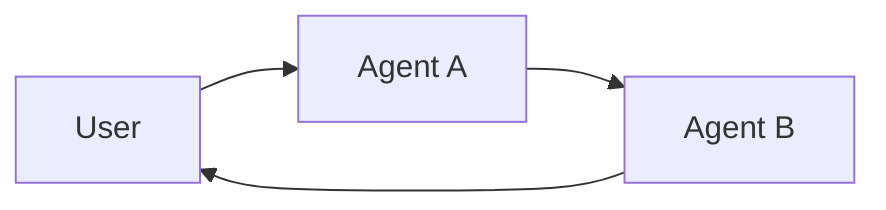

**多代理系统**将复杂的应用程序分解为多个专门的代理，它们协同工作来解决问题。
与其依赖单个代理来处理每个步骤，**多代理架构**允许您将更小、专注的代理组合成协调的工作流。

多代理系统在以下情况下很有用：

* 单个代理有太多工具，在决定使用哪个工具时做出糟糕的决策。
* 上下文或内存增长太大，单个代理无法有效跟踪。
* 任务需要**专业化**（例如，规划者、研究员、数学专家）。

## 多代理模式

| 模式                           | 工作原理                                                                                                                                                     | 控制流                                               | 示例用例                                 |
|-----------------------------------|------------------------------------------------------------------------------------------------------------------------------------------------------------------|------------------------------------------------------------|--------------------------------------------------|
| [**工具调用**](#tool-calling) | **监督者**代理将其他代理作为*工具*调用。"工具"代理不直接与用户对话——它们只是运行任务并返回结果。                  | 集中式：所有路由都通过调用代理。 | 任务编排、结构化工作流。        |
| [**交接**](#handoffs)         | 当前代理决定**转移控制权**给另一个代理。活动代理发生变化，用户可能继续直接与新代理交互。 | 去中心化：代理可以改变谁是活动的。            | 多域对话、专家接管。 |

<Card
    title="教程：构建监督者代理"
    icon="sitemap"
    href="/oss/python/langchain/supervisor"
    arrow cta="了解更多"
>
    了解如何使用监督者模式构建个人助手，其中中央监督者代理协调专门的辅助代理。
    本教程演示：
    * 为不同领域（日历和电子邮件）创建专门的子代理
    * 将子代理包装为工具以进行集中编排
    * 为敏感操作添加人在回路审查
</Card>


## 选择模式

| 问题                                              | 工具调用 | 交接 |
|-------------------------------------------------------|--------------|----------|
| 需要对工作流进行集中控制？               | ✅ 是        | ❌ 否     |
| 希望代理直接与用户交互？       | ❌ 否         | ✅ 是    |
| 专家之间复杂、类似人类的对话？ | ❌ 有限    | ✅ 强 |

<Tip>
    您可以混合使用两种模式——使用**交接**进行代理切换，并让每个代理**将子代理作为工具调用**以执行专门任务。
</Tip>

## 自定义代理上下文

多代理设计的核心是**上下文工程** - 决定每个代理看到什么信息。LangChain 为您提供细粒度控制：

* 对话或状态的哪些部分传递给每个代理。
* 为子代理量身定制的专门提示。
* 包含/排除中间推理。
* 为每个代理自定义输入/输出格式。

系统的质量**严重依赖**上下文工程。目标是确保每个代理都能访问执行任务所需的正确数据，无论它是作为工具还是作为活动代理。

## 工具调用

在**工具调用**中，一个代理（"**控制器**"）将其他代理视为*工具*，在需要时调用。控制器管理编排，而工具代理执行特定任务并返回结果。

流程：

1. **控制器**接收输入并决定调用哪个工具（子代理）。
2. **工具代理**根据控制器的指令运行其任务。
3. **工具代理**将结果返回给控制器。
4. **控制器**决定下一步或完成。


```mermaid
graph LR
    A[User] --> B[Controller Agent]
    B --> C[Tool Agent 1]
    B --> D[Tool Agent 2]
    C --> B
    D --> B
    B --> E[User Response]
````

<Tip>
    用作工具的代理通常**不期望**继续与用户对话。
    它们的作用是执行任务并将结果返回给控制器代理。
    如果您需要子代理能够与用户对话，请改用**交接**。
</Tip>

### 实现

下面是一个最小示例，其中主代理通过工具定义访问单个子代理：

```python
from langchain.tools import tool
from langchain.agents import create_agent


subagent1 = create_agent(model="...", tools=[...])

@tool(
    "subagent1_name",
    description="subagent1_description"
)
def call_subagent1(query: str):
    result = subagent1.invoke({
        "messages": [{"role": "user", "content": query}]
    })
    return result["messages"][-1].content

agent = create_agent(model="...", tools=[call_subagent1])
```


在此模式中：
1. 主代理在决定任务与子代理的描述匹配时调用 `call_subagent1`。
2. 子代理独立运行并返回其结果。
3. 主代理接收结果并继续编排。

### 自定义位置

有几个点可以控制上下文在主代理和其子代理之间传递的方式：

1. **子代理名称** (`"subagent1_name"`)：这是主代理引用子代理的方式。由于它影响提示，请仔细选择。
2. **子代理描述** (`"subagent1_description"`)：这是主代理对子代理的"了解"。它直接影响主代理决定何时调用它。
3. **子代理的输入**：您可以自定义此输入以更好地塑造子代理如何解释任务。在上面的示例中，我们直接传递代理生成的 `query`。
4. **子代理的输出**：这是传递回主代理的**响应**。您可以调整返回的内容以控制主代理如何解释结果。在上面的示例中，我们返回最终消息文本，但您可以返回其他状态或元数据。

### 控制子代理的输入

有两个主要杠杆可以控制主代理传递给子代理的输入：

* **修改提示** – 调整主代理的提示或工具元数据（即子代理的名称和描述）以更好地指导它何时以及如何调用子代理。
* **上下文注入** – 通过调整工具调用以从代理状态中提取，添加在静态提示中不实用捕获的输入（例如，完整消息历史、先前结果、任务元数据）。

```python
from langchain.agents import AgentState
from langchain.tools import tool, ToolRuntime

class CustomState(AgentState):
    example_state_key: str

@tool(
    "subagent1_name",
    description="subagent1_description"
)
def call_subagent1(query: str, runtime: ToolRuntime[None, CustomState]):
    # Apply any logic needed to transform the messages into a suitable input
    subagent_input = some_logic(query, runtime.state["messages"])
    result = subagent1.invoke({
        "messages": subagent_input,
        # You could also pass other state keys here as needed.
        # Make sure to define these in both the main and subagent's
        # state schemas.
        "example_state_key": runtime.state["example_state_key"]
    })
    return result["messages"][-1].content
```


### 控制子代理的输出

塑造主代理从子代理接收内容的两种常见策略：

* **修改提示** – 优化子代理的提示以准确指定应返回的内容。
  * 当输出不完整、过于冗长或缺少关键细节时很有用。
  * 一个常见的失败模式是子代理执行工具调用或推理，但**没有在最终消息中包含结果**。提醒它控制器（和用户）只能看到最终输出，因此所有相关信息必须包含在那里。
* **自定义输出格式** – 在将子代理的响应返回给主代理之前，在代码中调整或丰富它。
  * 示例：除了最终文本之外，还将特定状态键传递回主代理。
  * 这需要将结果包装在 [`Command`](https://reference.langchain.com/python/langgraph/types/#langgraph.types.Command)（或等效结构）中，以便您可以将自定义状态与子代理的响应合并。

```python
from typing import Annotated
from langchain.agents import AgentState
from langchain.tools import InjectedToolCallId
from langgraph.types import Command


@tool(
    "subagent1_name",
    description="subagent1_description"
)
# We need to pass the `tool_call_id` to the sub agent so it can use it to respond with the tool call result
def call_subagent1(
    query: str,
    tool_call_id: Annotated[str, InjectedToolCallId],
# You need to return a `Command` object to include more than just a final tool call
) -> Command:
    result = subagent1.invoke({
        "messages": [{"role": "user", "content": query}]
    })
    return Command(update={
        # This is the example state key we are passing back
        "example_state_key": result["example_state_key"],
        "messages": [
            ToolMessage(
                content=result["messages"][-1].content,
                # We need to include the tool call id so it matches up with the right tool call
                tool_call_id=tool_call_id
            )
        ]
    })
```


## 交接

在**交接**中，代理可以直接相互传递控制权。"活动"代理发生变化，用户与当前拥有控制权的任何代理交互。

流程：

1. **当前代理**决定它需要另一个代理的帮助。
2. 它将控制权（和状态）传递给**下一个代理**。
3. **新代理**直接与用户交互，直到它决定再次交接或完成。




### 实现（即将推出）

---

<Callout icon="pen-to-square" iconType="regular">
    [Edit the source of this page on GitHub.](https://github.com/langchain-ai/docs/edit/main/src/oss\langchain\multi-agent.mdx)
</Callout>
<Tip icon="terminal" iconType="regular">
    [Connect these docs programmatically](/use-these-docs) to Claude, VSCode, and more via MCP for real-time answers.
</Tip>
