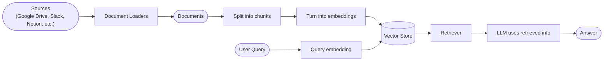
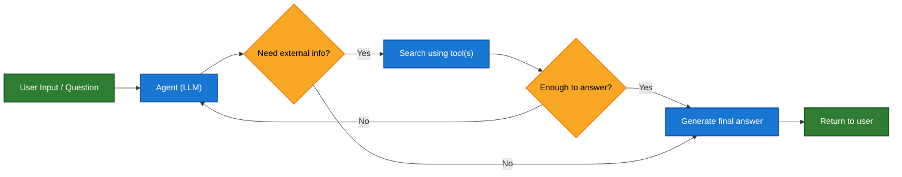
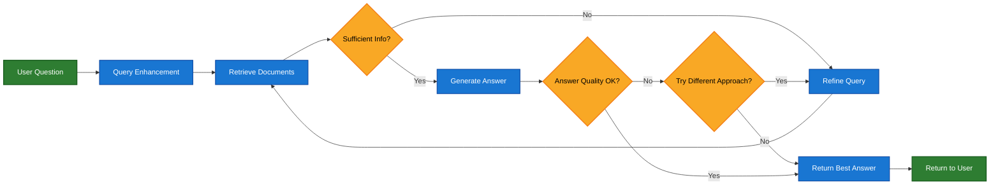

大语言模型（LLM）很强大，但它们有两个关键限制：

* **有限的上下文** — 它们无法一次性摄取整个语料库。
* **静态知识** — 它们的训练数据在某个时间点被冻结。

检索通过在查询时获取相关的外部知识来解决这些问题。这是**检索增强生成（RAG）**的基础：用特定上下文的信息增强 LLM 的答案。


## 构建知识库

**知识库**是在检索过程中使用的文档或结构化数据的存储库。

如果您需要自定义知识库，可以使用 LangChain 的文档加载器和向量存储从您自己的数据构建一个。

<Note>
    如果您已经有知识库（例如，SQL 数据库、CRM 或内部文档系统），您**不需要**重建它。您可以：
    - 将其作为**工具**连接到代理式 RAG 中的代理。
    - 查询它并将检索到的内容作为上下文提供给 LLM [（两步 RAG）](#2-step-rag)。
</Note>

请参阅以下教程以构建可搜索的知识库和最小 RAG 工作流：

<Card
    title="教程：语义搜索"
    icon="database"
    href="/oss/python/langchain/knowledge-base"
    arrow cta="了解更多"
>
    了解如何使用 LangChain 的文档加载器、嵌入和向量存储从您自己的数据创建可搜索的知识库。
    在本教程中，您将在 PDF 上构建搜索引擎，从而能够检索与查询相关的段落。您还将在此引擎之上实现最小 RAG 工作流，以了解如何将外部知识集成到 LLM 推理中。
</Card>

### 从检索到 RAG

检索允许 LLM 在运行时访问相关上下文。但大多数实际应用更进一步：它们**将检索与生成相结合**，以产生有根据的、上下文感知的答案。

这就是**检索增强生成（RAG）**背后的核心思想。检索管道成为更广泛系统的基础，该系统将搜索与生成相结合。

### 检索管道

典型的检索工作流如下所示：



每个组件都是模块化的：您可以交换加载器、分割器、嵌入或向量存储，而无需重写应用的逻辑。

### 构建块

<Columns cols={2}>
    <Card
        title="文档加载器"
        icon="file-import"
        href="/oss/python/integrations/document_loaders"
        arrow cta="了解更多"
    >
        从外部源（Google Drive、Slack、Notion 等）摄取数据，返回标准化的 [`Document`](https://reference.langchain.com/python/langchain_core/documents/#langchain_core.documents.base.Document) 对象。
    </Card>

    <Card
        title="文本分割器"
        icon="scissors"
        href="/oss/python/integrations/splitters"
        arrow
        cta="了解更多"
    >
        将大型文档分解为较小的块，这些块可以单独检索并适合模型的上下文窗口。
    </Card>

    <Card
        title="嵌入模型"
        icon="diagram-project"
        href="/oss/python/integrations/text_embedding"
        arrow
        cta="了解更多"
    >
        嵌入模型将文本转换为数字向量，使得具有相似含义的文本在该向量空间中彼此靠近。
    </Card>

    <Card
        title="向量存储"
        icon="database"
        href="/oss/python/integrations/vectorstores/"
        arrow
        cta="了解更多"
    >
        用于存储和搜索嵌入的专用数据库。
    </Card>

    <Card
        title="检索器"
        icon="binoculars"
        href="/oss/python/integrations/retrievers/"
        arrow
        cta="了解更多"
    >
        检索器是一个接口，给定非结构化查询时返回文档。
    </Card>
</Columns>

## RAG 架构

RAG 可以通过多种方式实现，具体取决于系统的需求。我们在下面的部分中概述每种类型。

| 架构            | 描述                                                                | 控制   | 灵活性 | 延迟        | 示例用例                                   |
|-------------------------|----------------------------------------------------------------------------|-----------|-------------|----------------|----------------------------------------------------|
| **两步 RAG**          | 检索总是在生成之前发生。简单且可预测         | ✅ 高    | ❌ 低       | ⚡ 快         | 常见问题解答、文档机器人                           |
| **代理式 RAG**         | 由 LLM 驱动的代理决定*何时*以及*如何*在推理过程中检索 | ❌ 低     | ✅ 高      | ⏳ 可变     | 可以访问多个工具的研究助手  |
| **混合式**              | 结合两种方法的特征，并带有验证步骤          | ⚖️ 中等 | ⚖️ 中等   | ⏳ 可变     | 具有质量验证的特定领域问答        |

<Info>
**延迟**：在**两步 RAG** 中，延迟通常更**可预测**，因为 LLM 调用的最大数量是已知的并且有上限。这种可预测性假设 LLM 推理时间是主要因素。但是，实际延迟也可能受到检索步骤性能的影响——例如 API 响应时间、网络延迟或数据库查询——这些可能因使用的工具和基础设施而异。
</Info>

### 两步 RAG

在**两步 RAG** 中，检索步骤总是在生成步骤之前执行。这种架构简单且可预测，适用于许多应用，其中检索相关文档是生成答案的明确先决条件。


<Card
    title="教程：检索增强生成（RAG）"
    icon="robot"
    href="/oss/python/langchain/rag#rag-chains"
    arrow cta="了解更多"
>
    了解如何构建一个可以基于您的数据回答问题的 Q&A 聊天机器人，使用检索增强生成。
    本教程介绍了两种方法：
    * 使用灵活工具运行搜索的**RAG 代理**——非常适合通用用途。
    * 每个查询只需要一次 LLM 调用的**两步 RAG** 链——对于更简单的任务快速高效。
</Card>

### 代理式 RAG

**代理式检索增强生成（RAG）** 结合了检索增强生成与基于代理的推理的优势。代理（由 LLM 驱动）不是先检索文档再回答，而是逐步推理，并在交互过程中决定**何时**以及**如何**检索信息。

<Tip>
代理要启用 RAG 行为，只需要访问一个或多个可以获取外部知识的**工具**——例如文档加载器、Web API 或数据库查询。
</Tip>



```python
import requests
from langchain.tools import tool
from langchain.chat_models import init_chat_model
from langchain.agents import create_agent


@tool
def fetch_url(url: str) -> str:
    """Fetch text content from a URL"""
    response = requests.get(url, timeout=10.0)
    response.raise_for_status()
    return response.text

system_prompt = """\
Use fetch_url when you need to fetch information from a web-page; quote relevant snippets.
"""

agent = create_agent(
    model="claude-sonnet-4-5-20250929",
    tools=[fetch_url], # A tool for retrieval [!code highlight]
    system_prompt=system_prompt,
)
```


<Expandable title="扩展示例：用于 LangGraph 的 llms.txt 的代理式 RAG">

此示例实现了一个**代理式 RAG 系统**，以帮助用户查询 LangGraph 文档。代理首先加载 [llms.txt](https://llmstxt.org/)，它列出了可用的文档 URL，然后可以根据用户的问题动态使用 `fetch_documentation` 工具来检索和处理相关内容。

```python
import requests
from langchain.agents import create_agent
from langchain.messages import HumanMessage
from langchain.tools import tool
from markdownify import markdownify


ALLOWED_DOMAINS = ["https://langchain-ai.github.io/"]
LLMS_TXT = 'https://langchain-ai.github.io/langgraph/llms.txt'


@tool
def fetch_documentation(url: str) -> str:  # [!code highlight]
    """Fetch and convert documentation from a URL"""
    if not any(url.startswith(domain) for domain in ALLOWED_DOMAINS):
        return (
            "Error: URL not allowed. "
            f"Must start with one of: {', '.join(ALLOWED_DOMAINS)}"
        )
    response = requests.get(url, timeout=10.0)
    response.raise_for_status()
    return markdownify(response.text)


# We will fetch the content of llms.txt, so this can
# be done ahead of time without requiring an LLM request.
llms_txt_content = requests.get(LLMS_TXT).text

# System prompt for the agent
system_prompt = f"""
You are an expert Python developer and technical assistant.
Your primary role is to help users with questions about LangGraph and related tools.

Instructions:

1. If a user asks a question you're unsure about — or one that likely involves API usage,
   behavior, or configuration — you MUST use the `fetch_documentation` tool to consult the relevant docs.
2. When citing documentation, summarize clearly and include relevant context from the content.
3. Do not use any URLs outside of the allowed domain.
4. If a documentation fetch fails, tell the user and proceed with your best expert understanding.

You can access official documentation from the following approved sources:

{llms_txt_content}

You MUST consult the documentation to get up to date documentation
before answering a user's question about LangGraph.

Your answers should be clear, concise, and technically accurate.
"""

tools = [fetch_documentation]

model = init_chat_model("claude-sonnet-4-0", max_tokens=32_000)

agent = create_agent(
    model=model,
    tools=tools,  # [!code highlight]
    system_prompt=system_prompt,  # [!code highlight]
    name="Agentic RAG",
)

response = agent.invoke({
    'messages': [
        HumanMessage(content=(
            "Write a short example of a langgraph agent using the "
            "prebuilt create react agent. the agent should be able "
            "to look up stock pricing information."
        ))
    ]
})

print(response['messages'][-1].content)
```


</Expandable>

<Card
    title="教程：检索增强生成（RAG）"
    icon="robot"
    href="/oss/python/langchain/rag"
    arrow cta="了解更多"
>
    了解如何构建一个可以基于您的数据回答问题的 Q&A 聊天机器人，使用检索增强生成。
    本教程介绍了两种方法：
    * 使用灵活工具运行搜索的**RAG 代理**——非常适合通用用途。
    * 每个查询只需要一次 LLM 调用的**两步 RAG** 链——对于更简单的任务快速高效。
</Card>

### 混合式 RAG

混合式 RAG 结合了两步 RAG 和代理式 RAG 的特征。它引入了中间步骤，如查询预处理、检索验证和生成后检查。这些系统比固定管道提供更多灵活性，同时保持对执行的一些控制。

典型组件包括：

* **查询增强**：修改输入问题以提高检索质量。这可能涉及重写不明确的查询、生成多个变体或使用额外上下文扩展查询。
* **检索验证**：评估检索到的文档是否相关且充分。如果不是，系统可能会优化查询并再次检索。
* **答案验证**：检查生成的答案的准确性、完整性和与源内容的一致性。如果需要，系统可以重新生成或修改答案。

该架构通常支持这些步骤之间的多次迭代：



此架构适用于：

* 具有模糊或未明确指定查询的应用
* 需要验证或质量控制步骤的系统
* 涉及多个源或迭代优化的工作流

<Card
    title="教程：具有自我纠正的代理式 RAG"
    icon="robot"
    href="/oss/python/langgraph/agentic-rag"
    arrow cta="了解更多"
>
    一个**混合式 RAG** 的示例，它结合了代理式推理与检索和自我纠正。
</Card>

---

<Callout icon="pen-to-square" iconType="regular">
    [Edit the source of this page on GitHub.](https://github.com/langchain-ai/docs/edit/main/src/oss\langchain\retrieval.mdx)
</Callout>
<Tip icon="terminal" iconType="regular">
    [Connect these docs programmatically](/use-these-docs) to Claude, VSCode, and more via MCP for real-time answers.
</Tip>
