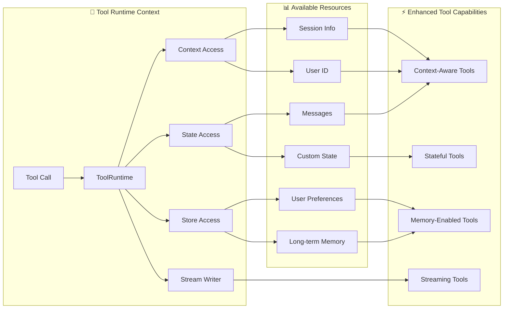

许多 AI 应用通过自然语言与用户交互。但是，某些用例要求模型使用结构化输入直接与外部系统（如 API、数据库或文件系统）交互。

工具是[代理](/oss/python/langchain/agents)调用以执行操作的组件。它们通过让模型通过明确定义的输入和输出与世界交互来扩展模型能力。工具封装了一个可调用函数及其输入模式。这些可以传递给兼容的[聊天模型](/oss/python/langchain/models)，允许模型决定是否调用工具以及使用什么参数。在这些场景中，工具调用使模型能够生成符合指定输入模式的请求。

<Note>
**服务器端工具使用**

某些聊天模型（例如 [OpenAI](/oss/python/integrations/chat/openai)、[Anthropic](/oss/python/integrations/chat/anthropic) 和 [Gemini](/oss/python/integrations/chat/google_generative_ai)）具有[内置工具](/oss/python/langchain/models#server-side-tool-use)，这些工具在服务器端执行，例如网络搜索和代码解释器。请参阅[提供者概述](/oss/python/integrations/providers/overview)以了解如何使用您的特定聊天模型访问这些工具。
</Note>

## 创建工具

### 基本工具定义

创建工具的最简单方法是使用 [`@tool`](https://reference.langchain.com/python/langchain/tools/#langchain.tools.tool) 装饰器。默认情况下，函数的文档字符串成为工具的描述，帮助模型理解何时使用它：

```python
from langchain.tools import tool

@tool
def search_database(query: str, limit: int = 10) -> str:
    """Search the customer database for records matching the query.

    Args:
        query: Search terms to look for
        limit: Maximum number of results to return
    """
    return f"Found {limit} results for '{query}'"
```

类型提示是**必需的**，因为它们定义了工具的输入模式。文档字符串应该信息丰富且简洁，以帮助模型理解工具的用途。


### 自定义工具属性

#### 自定义工具名称

默认情况下，工具名称来自函数名称。当您需要更具描述性的名称时，可以覆盖它：

```python
@tool("web_search")  # 自定义名称
def search(query: str) -> str:
    """Search the web for information."""
    return f"Results for: {query}"

print(search.name)  # web_search
```

#### 自定义工具描述

覆盖自动生成的工具描述，以便为模型提供更清晰的指导：

```python
@tool("calculator", description="Performs arithmetic calculations. Use this for any math problems.")
def calc(expression: str) -> str:
    """Evaluate mathematical expressions."""
    return str(eval(expression))
```

### 高级模式定义

使用 Pydantic 模型或 JSON 模式定义复杂输入：

<CodeGroup>
    ```python Pydantic model
    from pydantic import BaseModel, Field
    from typing import Literal

    class WeatherInput(BaseModel):
        """Input for weather queries."""
        location: str = Field(description="City name or coordinates")
        units: Literal["celsius", "fahrenheit"] = Field(
            default="celsius",
            description="Temperature unit preference"
        )
        include_forecast: bool = Field(
            default=False,
            description="Include 5-day forecast"
        )

    @tool(args_schema=WeatherInput)
    def get_weather(location: str, units: str = "celsius", include_forecast: bool = False) -> str:
        """Get current weather and optional forecast."""
        temp = 22 if units == "celsius" else 72
        result = f"Current weather in {location}: {temp} degrees {units[0].upper()}"
        if include_forecast:
            result += "\nNext 5 days: Sunny"
        return result
    ```

    ```python JSON Schema
    weather_schema = {
        "type": "object",
        "properties": {
            "location": {"type": "string"},
            "units": {"type": "string"},
            "include_forecast": {"type": "boolean"}
        },
        "required": ["location", "units", "include_forecast"]
    }

    @tool(args_schema=weather_schema)
    def get_weather(location: str, units: str = "celsius", include_forecast: bool = False) -> str:
        """Get current weather and optional forecast."""
        temp = 22 if units == "celsius" else 72
        result = f"Current weather in {location}: {temp} degrees {units[0].upper()}"
        if include_forecast:
            result += "\nNext 5 days: Sunny"
        return result
    ```
</CodeGroup>


## 访问上下文

<Info>
**为什么这很重要：**当工具可以访问代理状态、运行时上下文和长期记忆时，它们最强大。这使工具能够做出上下文感知的决策、个性化响应并在对话之间维护信息。

运行时上下文提供了一种在运行时将依赖项（如数据库连接、用户 ID 或配置）注入到工具中的方法，使它们更具可测试性和可重用性。


</Info>

工具可以通过 `ToolRuntime` 参数访问运行时信息，它提供：

- **State** - 在执行过程中流动的可变数据（例如，消息、计数器、自定义字段）
- **Context** - 不可变配置，如用户 ID、会话详细信息或特定于应用程序的配置
- **Store** - 跨对话的持久长期记忆
- **Stream Writer** - 在工具执行时流式传输自定义更新
- **Config** - 执行的 `RunnableConfig`
- **Tool Call ID** - 当前工具调用的 ID



### `ToolRuntime`

使用 `ToolRuntime` 在单个参数中访问所有运行时信息。只需将 `runtime: ToolRuntime` 添加到工具签名中，它将自动注入，而不会暴露给 LLM。

<Info>
**`ToolRuntime`**：一个统一的参数，为工具提供对状态、上下文、存储、流式传输、配置和工具调用 ID 的访问。这取代了使用单独的 [`InjectedState`](https://reference.langchain.com/python/langgraph/agents/#langgraph.prebuilt.tool_node.InjectedState)、[`InjectedStore`](https://reference.langchain.com/python/langgraph/agents/#langgraph.prebuilt.tool_node.InjectedStore)、[`get_runtime`](https://reference.langchain.com/python/langgraph/runtime/#langgraph.runtime.get_runtime) 和 [`InjectedToolCallId`](https://reference.langchain.com/python/langchain/tools/#langchain.tools.InjectedToolCallId) 注释的旧模式。

运行时自动为您的工具函数提供这些功能，而无需您显式传递它们或使用全局状态。
</Info>

**访问状态：**

工具可以使用 `ToolRuntime` 访问当前图状态：

```python
from langchain.tools import tool, ToolRuntime

# 访问当前对话状态
@tool
def summarize_conversation(
    runtime: ToolRuntime
) -> str:
    """Summarize the conversation so far."""
    messages = runtime.state["messages"]

    human_msgs = sum(1 for m in messages if m.__class__.__name__ == "HumanMessage")
    ai_msgs = sum(1 for m in messages if m.__class__.__name__ == "AIMessage")
    tool_msgs = sum(1 for m in messages if m.__class__.__name__ == "ToolMessage")

    return f"Conversation has {human_msgs} user messages, {ai_msgs} AI responses, and {tool_msgs} tool results"

# 访问自定义状态字段
@tool
def get_user_preference(
    pref_name: str,
    runtime: ToolRuntime  # ToolRuntime 参数对模型不可见
) -> str:
    """Get a user preference value."""
    preferences = runtime.state.get("user_preferences", {})
    return preferences.get(pref_name, "Not set")
```

<Warning>
`tool_runtime` 参数对模型隐藏。对于上面的示例，模型在工具模式中只看到 `pref_name` - `tool_runtime` *不*包含在请求中。
</Warning>

**更新状态：**

使用 [`Command`](https://reference.langchain.com/python/langgraph/types/#langgraph.types.Command) 更新代理的状态或控制图的执行流：

```python
from langgraph.types import Command
from langchain.messages import RemoveMessage
from langgraph.graph.message import REMOVE_ALL_MESSAGES
from langchain.tools import tool, ToolRuntime

# 通过删除所有消息来更新对话历史
@tool
def clear_conversation() -> Command:
    """Clear the conversation history."""

    return Command(
        update={
            "messages": [RemoveMessage(id=REMOVE_ALL_MESSAGES)],
        }
    )

# 更新代理状态中的 user_name
@tool
def update_user_name(
    new_name: str,
    runtime: ToolRuntime
) -> Command:
    """Update the user's name."""
    return Command(update={"user_name": new_name})
```


#### 上下文

通过 `runtime.context` 访问不可变配置和上下文数据，如用户 ID、会话详细信息或特定于应用程序的配置。

工具可以通过 `ToolRuntime` 访问运行时上下文：

```python
from dataclasses import dataclass
from langchain_openai import ChatOpenAI
from langchain.agents import create_agent
from langchain.tools import tool, ToolRuntime


USER_DATABASE = {
    "user123": {
        "name": "Alice Johnson",
        "account_type": "Premium",
        "balance": 5000,
        "email": "alice@example.com"
    },
    "user456": {
        "name": "Bob Smith",
        "account_type": "Standard",
        "balance": 1200,
        "email": "bob@example.com"
    }
}

@dataclass
class UserContext:
    user_id: str

@tool
def get_account_info(runtime: ToolRuntime[UserContext]) -> str:
    """Get the current user's account information."""
    user_id = runtime.context.user_id

    if user_id in USER_DATABASE:
        user = USER_DATABASE[user_id]
        return f"Account holder: {user['name']}\nType: {user['account_type']}\nBalance: ${user['balance']}"
    return "User not found"

model = ChatOpenAI(model="gpt-4o")
agent = create_agent(
    model,
    tools=[get_account_info],
    context_schema=UserContext,
    system_prompt="You are a financial assistant."
)

result = agent.invoke(
    {"messages": [{"role": "user", "content": "What's my current balance?"}]},
    context=UserContext(user_id="user123")
)
```


#### 记忆（存储）

使用存储访问跨对话的持久数据。存储通过 `runtime.store` 访问，允许您保存和检索特定于用户或特定于应用程序的数据。

工具可以通过 `ToolRuntime` 访问和更新存储：

```python expandable
from typing import Any
from langgraph.store.memory import InMemoryStore
from langchain.agents import create_agent
from langchain.tools import tool, ToolRuntime


# 访问记忆
@tool
def get_user_info(user_id: str, runtime: ToolRuntime) -> str:
    """Look up user info."""
    store = runtime.store
    user_info = store.get(("users",), user_id)
    return str(user_info.value) if user_info else "Unknown user"

# 更新记忆
@tool
def save_user_info(user_id: str, user_info: dict[str, Any], runtime: ToolRuntime) -> str:
    """Save user info."""
    store = runtime.store
    store.put(("users",), user_id, user_info)
    return "Successfully saved user info."

store = InMemoryStore()
agent = create_agent(
    model,
    tools=[get_user_info, save_user_info],
    store=store
)

# 第一次会话：保存用户信息
agent.invoke({
    "messages": [{"role": "user", "content": "Save the following user: userid: abc123, name: Foo, age: 25, email: foo@langchain.dev"}]
})

# 第二次会话：获取用户信息
agent.invoke({
    "messages": [{"role": "user", "content": "Get user info for user with id 'abc123'"}]
})
# Here is the user info for user with ID "abc123":
# - Name: Foo
# - Age: 25
# - Email: foo@langchain.dev
```


#### 流式写入器

使用 `runtime.stream_writer` 在工具执行时流式传输自定义更新。这对于向用户提供有关工具正在执行的操作的实时反馈很有用。

```python
from langchain.tools import tool, ToolRuntime

@tool
def get_weather(city: str, runtime: ToolRuntime) -> str:
    """Get weather for a given city."""
    writer = runtime.stream_writer

    # 在工具执行时流式传输自定义更新
    writer(f"Looking up data for city: {city}")
    writer(f"Acquired data for city: {city}")

    return f"It's always sunny in {city}!"
```

<Note>
如果您在工具内使用 `runtime.stream_writer`，则必须在 LangGraph 执行上下文中调用该工具。有关更多详细信息，请参阅[流式传输](/oss/python/langchain/streaming)。
</Note>

---

<Callout icon="pen-to-square" iconType="regular">
    [Edit the source of this page on GitHub.](https://github.com/langchain-ai/docs/edit/main/src/oss\langchain\tools.mdx)
</Callout>
<Tip icon="terminal" iconType="regular">
    [Connect these docs programmatically](/use-these-docs) to Claude, VSCode, and more via MCP for real-time answers.
</Tip>
